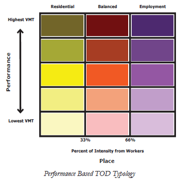

There are two sets of VERPAT input folders - [definitions](#definitions) and [inputs](#inputs).

# Definitions
The following five files need to be configured in the "defs" directory:
  - [run_parameters.json](#run_parametersjson)
  - [model_parameters.json](#model_parametersjson)
  - [deflators.csv](#deflatorscsv)
  - [geo.csv](#geocsv)
  - [units.csv](#unitscsv)

## run_parameters.json

The "run_parameters.json" file contains parameters that define key attributes of the model run and relationships to other model runs. A more detailed description of the file can be found [here](https://github.com/gregorbj/VisionEval/blob/master/api/model_system_design.md#61-model-directory-structure). The format of the VERPAT *run_parameters.json* file is as follows:

```json
{
    "Model": ["RPAT"],
    "Scenario": ["RPAT Pilot"],
    "Description": ["Pilot RPAT module in VisionEval"],
    "Region": ["Multnomah County Oregon"],
    "BaseYear": ["2005"],
    "Years": ["2005", "2035"],
    "DatastoreName": ["Datastore"],
    "DatastoreType": ["RD"],
    "Seed": [1],
    "RunTypes": ["E", "ELESNP"]
}
```


## model_parameters.json

The "model_parameters.json" can contain global parameters for a particular model configuration that may be used by multiple modules. A more detailed description of the file and its structure can be found [here](https://github.com/gregorbj/VisionEval/blob/master/api/model_system_design.md#61-model-directory-structure). The format of the VERPAT *model_parameters.json* file is as follows:

```json
[
  {"NAME": "EmploymentGrowth",
   "VALUE": "1.5",
   "TYPE": "double",
   "UNITS": "multiplier",
   "PROHIBIT": "",
   "ISELEMENTOF": ""},
  {
    "NAME": "FwyLaneMiGrowth",
    "VALUE": "1",
    "TYPE" : "double",
    "UNITS" : "multiplier",
    "PROHIBIT" : "c('NA', '< 0')",
    "ISELEMENTOF" : ""
  },
  {
    "NAME" : "ArtLaneMiGrowth",
    "VALUE": "1",
    "TYPE" : "double",
    "UNITS" : "multiplier",
    "PROHIBIT" : "c('NA', '< 0')",
    "ISELEMENTOF" : ""
  },
  .
  .
  .
  {
    "NAME" : "AutoCostGrowth",
    "VALUE": "1.5",
    "TYPE" : "double",
    "UNITS" : "multiplier",
    "PROHIBIT" : "c('NA', '< 0')",
    "ISELEMENTOF" : ""
  }
]
```


## deflators.csv
The **deflators.csv** file defines the annual deflator values, such as the consumer price index, that are used to convert currency values between different years for currency denomination. The format of the file is as follows:

|              Year              |  Value   |
| :----------------------------: | :------: |
|              1999              |  172.6   |
|              2000              |   178    |
|              2001              |  182.4   |
|  |  |

## geo.csv

The "geography.csv" file describes all of the geographic relationships for the model and the names of geographic entities in a [CSV-formatted](https://en.wikipedia.org/wiki/Comma-separated_values) text file. The format of the file is as follows:

| [Azone](https://github.com/gregorbj/VisionEval/blob/master/api/model_system_design.md#62-model-geography) | [Bzone](https://github.com/gregorbj/VisionEval/blob/master/api/model_system_design.md#62-model-geography) | [Czone](https://github.com/gregorbj/VisionEval/blob/master/api/model_system_design.md#62-model-geography) | [Marea](https://github.com/gregorbj/VisionEval/blob/master/api/model_system_design.md#62-model-geography) |
| :----------------------------------------------------------: | :----------------------------------------------------------: | :----------------------------------------------------------: | :----------------------------------------------------------: |
|                          Multnomah                           |                             Rur                              |                              NA                              |                          Multnomah                           |
|                          Multnomah                           |                            Sub_R                             |                              NA                              |                          Multnomah                           |
|                          Multnomah                           |                            Sub_E                             |                              NA                              |                          Multnomah                           |
|                          Multnomah                           |                            Sub_M                             |                              NA                              |                          Multnomah                           |
|                          Multnomah                           |                            Sub_T                             |                              NA                              |                          Multnomah                           |
|                          Multnomah                           |                            CIC_R                             |                              NA                              |                          Multnomah                           |
|                          Multnomah                           |                            CIC_E                             |                              NA                              |                          Multnomah                           |
|                          Multnomah                           |                            CIC_M                             |                              NA                              |                          Multnomah                           |
|                          Multnomah                           |                            CIC_T                             |                              NA                              |                          Multnomah                           |
|                          Multnomah                           |                             UC_R                             |                              NA                              |                          Multnomah                           |
|                          Multnomah                           |                             UC_E                             |                              NA                              |                          Multnomah                           |
|                          Multnomah                           |                             UC_M                             |                              NA                              |                          Multnomah                           |
|                          Multnomah                           |                             UC_T                             |                              NA                              |                          Multnomah                           |

The geography is described by 13 place types as shown below. One emerging school of thought in land use planning is to consider land uses in terms of place types instead of simply residential or commercial or high density compared to low density. A place type refers to all of the characteristics of a developed area including the types of uses included, the mix of uses, the density and intensity of uses.

|                                  | URBAN <br />CORE | CLOSE-IN <br />COMMUNITY |   SUBURBAN   |    RURAL     |
| :------------------------------- | :--------------: | :----------------------: | :----------: | :----------: |
| **Residential**                  |      |              |  |              |
| **Commercial**                   |      |              |  |              |
| **Mixed-Use**                    |      |              |  |              |
| **Transit-Oriented Development** |      |              |  |              |
| **Rural/Greenfield**             |                  |                          |              |  |

An initial typology or system to organize place types can be traced to the Smart Growth Transect, which contained six zones in its original configuration including:

- Rural Preserve
- Rural Reserve
- Edge
- General
- Center
- Core

This approach to classifying place types was further refined in the Caltrans Smart Mobility which defined the following seven place types including:

- Urban Centers
- Close-In Compact Communities
- Compact Communities
- Suburban Communities
- Rural and Agricultural Lands
- Protected Lands
- Special Use Areas

Several of these place type categories provided additional options such as the Close-In Compact Communities which had three sub-definitions including Close-In-Centers, Close-In Corridors, and Close-In Neighborhoods.

An alternative view of place types was provided by Reconnecting America, which developed a performance based place type approach for describing areas proximate to transit stations. Station areas would vary in terms of their relative focus between residential units, employees or a mix of the two. Station areas are also characterized on their relative intensity as well as shown below.



The approach employed for the place types in RPAT is therefore an amalgam of these approaches, in that the terminology is borrowed from the Smart Growth Transect and Caltrans Smart Mobility Study, while the relative performance of each place type is taken from the Reconnecting America approach but applied to a region instead of transit station sites.

Four general area types are defined in RPAT including:

- The **Urban Core** is the high-density mixed-use places with high jobs-housing ratios, well connected streets and high levels of pedestrian activities. It is anticipated that for many regions, the Urban Core will be the traditional downtown area of which there likely would be only one.
- The **Close-in Community** would be those areas located near to the Urban Cores and would consist primarily of housing with scattered mixed-use centers and arterial corridors. Housing would be varied in terms of density and type. Transit would be available with a primary focus on commute trips. These areas may be classified by their residents as suburban would be considered to be close-in communities given their adjacency to the Downtown and therefore the higher levels of regional accessibility.
- The **Suburban** place type is anticipated to represent the majority of development within regions. These communities are characterized by low level of integration of housing with jobs, retail, and services, poorly connected street networks, low levels of transit service, large amounts of surface parking, and limited walk ability.
- The **Rural** place type is defined as settlements of widely spaced towns separated by firms, vineyards, orchards, or grazing lands. These areas would be characterized by widely dispersed residential uses, little or no transit service, and very limited pedestrian facilities.

Further definition of the place types is allowed through the use of development types within the Urban Core, Close-in Community, and Suburban area types including:

- **Residential** includes all place types that are predominantly residential in character with limited employment and retail opportunities. Examples of this development type might include typical Suburban Residential or areas of the Downtown which are primarily residential as well. It is anticipated that this development type may be found in all of the area types except for rural.
- **Employment** includes those areas which are focused on employment with limited retail and residential. An example of this might include a Suburban Office Complex or a large cluster of office buildings within a Close-in Community or Urban Core. As with the residential development type, it is anticipated that this type of use would be found in all place types except for rural.
- **Mixed-Use** are those areas within a region which have a mix of residential, employment, and retail uses. While this development type can be found in the Suburban place type, it is most commonly found in the close-in community and urban core place type. Downtown areas that have retained their residential population to complement the employment are examples of this development type.
- **Transit-Oriented Development (TOD)** which is similar to the other development types in that it is applied to all area types except for Rural areas since it is thought to be highly unlikely that a rural TOD would be developed. The TOD development type is characterized by greater access to transit in all area types. Examples of this development type might include a Suburban TOD focused on a commuter rail station.

The process of allocating existing land use to the 13 place types is somewhat dependent on the types of data available in a region that describe existing land use, and the process can be either very detailed or somewhat simplified. The following description relays the process developed by Atlanta Regional Commission (ARC) as part of the pilot testing of RPAT and provides an example of how, mechanically, an agency can approach this allocation. It should be noted that this is merely one approach and not a specific recommendation for a method that should be followed.

In general, ARC followed a somewhat detailed process to derive input data from land use data as presented in their “Unified Growth Policy Map”, and from their regional travel demand model. They developed heuristics to align their land use with the 13 place types that RPAT uses.

The conversion of land use data to the place type scheme used in RPAT involved taking ARC’s Unified Growth Policy Map (UGPM) Areas and converting them to the 13 RPAT place types.

1. The first step was to allocate the UGPM areas to the four area types used in RPAT. The Urban Core area type includes Region Core, Region Employment Centers and Aerotropolis UGPM areas; Close-in Community includes Maturing Neighborhoods; Suburban includes Developing Suburbs and Established Suburbs; and Rural includes Rural Areas and Developing Rural.
2. The ARC traffic analysis zone (TAZ) system was overlaid with the area types and the centroid of the TAZ was used to determine its area type.
3. The RPAT development type, the other dimension of the place type matrix, which included residential, mixed-use, employment, and TOD development types was determined for each TAZ not in the rural area type using the base year percentage of the TAZ’s employment in relation to the total of the population and employment in the TAZ. The mix between the employment and employment was used to determine the TAZs development type using the following cut points:
   - Residential: < 33.33% 
   - Mixed Use: 33.33% to 66.67%
   - Employment: > 66.67%
4. Identify any TAZs that are TOD based on transit service and specific development types: only one TAZ was determined to be TOD as a development type, Lindbergh Center, in the Urban Core area type.
5. The combination of the area type and the development type was then used to allocate all TAZs to one of the 13 place types.

The following is an enumeration of each place type abbreviation as it appears in the input file as well as a brief description of that value:

| Abbreviation | Description                                     |
| ------------ | ----------------------------------------------- |
| Rur          | Rural                                           |
| Sub_R        | Suburban Residential                            |
| Sub_E        | Suburban Employment (i.e. Commercial)           |
| Sub_M        | Suburban Mixed Use                              |
| Sub_T        | Suburban Transit Oriented Development           |
| CIC_R        | Close-in Community Residential                  |
| CIC_E        | Close-in Community Employment (i.e. Commercial) |
| CIC_M        | Close-in Community Mixed Use                    |
| CIC_T        | Close-in Community Transit Oriented Development |
| UC_R         | Urban Core Residential                          |
| UC_E         | Urban Core Employment (i.e. Commercial)         |
| UC_M         | Urban Core Mixed Use                            |
| UC_T         | Urban Core Transit Oriented Development         |


## units.csv

The "units.csv" file describes the default units to be used for storing complex data types in the model. The format of the file is as follows:

| Type     | Units    |
| -------- | -------- |
| currency | USD      |
| distance | MI       |
| area     | SQMI     |
|  |  |

The VisionEval model system keeps track of the types and units of measure of all data that is processed. More details about the file and structure can be found [here](https://github.com/gregorbj/VisionEval/blob/master/api/model_system_design.md#63-data-types-units-and-currency-deflators).

# Inputs