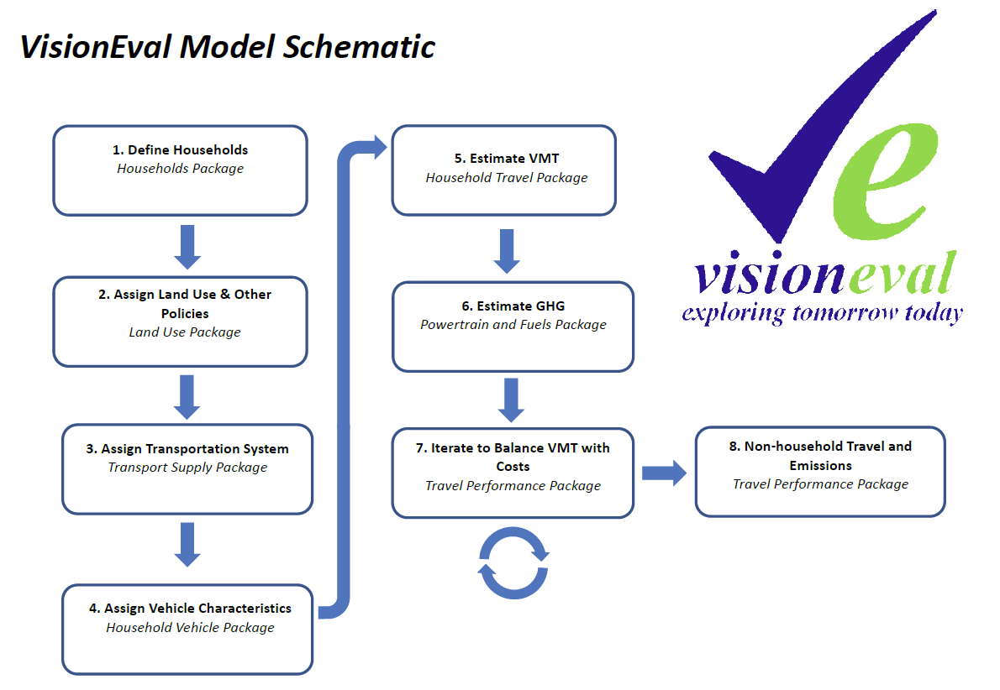

### Overview of the VERPAT modeling process

The diagram below illustrates the modeling system with inputs, model components, and feedback loops. Links are provided to the source code that implements each section.

<table>
  <tr>
    <td></td>
    <td> <ul> 
	<li> <a href="https://github.com/gregorbj/VisionEval/tree/master/sources/modules/VESimHouseholds"> Household Synthesis </a> </li>
	<li> <a href="https://github.com/gregorbj/VisionEval/tree/master/sources/modules/VESyntheticFirms"> Firm Synthesis </a> </li> 
	<li> <a href="https://github.com/gregorbj/VisionEval/tree/master/sources/modules/VELandUse"> Urban Form </a> </li>
	<li> <a href="https://github.com/gregorbj/VisionEval/tree/master/sources/modules/VETransportSupply"> Accessibility </a> </li>
	<li> <a href="https://github.com/gregorbj/VisionEval/tree/master/sources/modules/VEHouseholdVehicles"> Vehicle Models </a> </li>
	<li> <a href="https://github.com/gregorbj/VisionEval/tree/master/sources/modules/VEHouseholdTravel"> Auto Travel Demand </a> </li>
	<li> <a href="https://github.com/gregorbj/VisionEval/tree/master/sources/modules/VEHouseholdTravel"> Truck and Bus Travel Demand </a> </li>
	<li> <a href="https://github.com/gregorbj/VisionEval/tree/master/sources/modules/VETransportSupplyUse"> Congestion </a> </li>
	<li> <a href="https://github.com/gregorbj/VisionEval/tree/master/sources/modules/VEHouseholdTravel"> Induced Demand </a> </li> 
	<li> <a href="https://github.com/gregorbj/VisionEval/tree/master/sources/modules/VEHouseholdTravel"> Policy Benefits </a> </li> 
	</ul> </td>
  </tr>
</table>

For more, see [[VERPAT Modules and Outputs | VERPAT-Modules-and-Outputs]].

### VisionEval Summary

The VisionEval model is a strategic modeling tool for the purpose of estimating and forecasting the effects of various policies and other influences on the amount of vehicle travel, the types of vehicles and fuels used, and the resulting greenhouse gas (GHG) emissions among other things. VisionEval can be configured to run at the State or regional level.
VisionEval estimates vehicle ownership, vehicle travel, fuel consumption, and GHG emissions at the individual household level. This structure accounts for the synergistic and antagonistic effects of multiple policies and factors (e.g. gas prices) on vehicle travel and emissions. For example, the battery range of electric vehicles (EVs) and plug-in hybrid electric vehicles (PHEVs) is less of an issue for households residing in compact mixed-use neighborhoods because those households tend to drive fewer miles each day. Modeling at the household level makes it possible to evaluate the relationships between travel, emissions and the characteristics of households, land use, transportation systems, vehicles, and other factors. In addition, household level analysis makes it possible to evaluate the equitability of the costs and benefits of different strategies.
The model comprises a series of sequential steps with feedback. Each calculation step is composed of a number of calculations that operate on the results of the previous calculation step and on input data that reflect inputs. The nature of each calculation was determined through the statistical analysis of several data sources such as the National Household Travel Survey. A key method employed in many steps is to sample from observed or target distributions. For example, choosing which households are enrolled in a car sharing program is done by first isolating the correct conditions (e.g., applicable densities) and then randomly assigning enrollment to every Xth household that meets the criteria. Each component calculation was estimated and checked using source data.
The modeling steps are grouped as follows:

  + Define households and associated polices;
  + Characterize vehicles;
  + Calculate VMT and Emissions, and,
  + Balance VMT with travel costs.
  + Estimate non-household travel and emissions
  
The iterative process to balance the VMT with travel costs allows fees and other costs introduced at this step to influence the amount of travel. This step balances the amount of household travel with the cost of travel and recalculates household VMT, Fuel & GHG in the process.
The primary outputs of VisionEval are household travel, fuel and power consumption, and GHG emissions calculations, but other information is produced for households and commercial vehicles as well. The amount of commercial (light-duty), transit and freight (heavy duty) travel is calculated as well as associated fuel, power consumption and GHG emissions for those vehicles. .
VisionEval is a new type of model, and its development has and is being peer-reviewed by state, national and international travel and emissions modeling experts. The Components are tested throughout the development process to check the reasonability of results and whether the model could replicate observed behavior and conditions.

### VisionEval Modules

[] = indicates VE modules

  1. Define Households - Households Package
Create synthetic households for the region, including persons [Create Households] and workers [Predict Workers] by age group. This determines lifecycle category for households (i.e. Elderly couple, Family with small children, single middle aged adults, etc.)[AssignLifecycle]. Identify total income for each household [PredictIncome].
  2. Assign Land Use and Other Policies - Land Use Package
Determines the dwelling type (single-family, multifamily, group quarters) for each household and their location within a zone of the region [PredictHousing]. Allocate jobs by type (total, retail, service) and their location in the region, and assign household workers to these employment locations [Locate Employment]. Assign land use characteristics to each zone and the households and workplaces within that zone. These include an initial development type (either urban or rural) [AssignDevType], 4D built form measures (e.g., density, diversity, design, and accessibility) [Calculate4DMeasures], which enables identification of mixed use areas (i.e., that meet the density, diversity, design, and accessibility criteria) [CalculateUrbanMixMeasure]. Add policies as they apply to each zone and thus home and work location. These include zone-based parking restrictions and price [Parking Restrictions], Demand Management Programs (households and/or worker participation) [AssignDemandManagement], car sharing services (TNC’s) availability [AssignCarSvcAvailability].
  3. Assign Transportation System - Transport Supply Package
Assign the regional transportation system, including road lane miles for freeways and arterials [AssignRoadMiles] and transit bus-equivalent revenue miles [AssignTransitService] per capita and transit vehicle-miles by vehicle type. Transit service is identified by zone.
  4. Assign Vehicle Characteristics - Household Vehicle Package
Assigns household driver and vehicle characteristics. This includes the number of drivers by age group [AssignDrivers], number of vehicles owned [AssignVehicleOwnership] and their type (auto or light truck) [AssignVehicleType], and age [AssignVehicleAge]. The ownership cost of each household vehicle is calculated [CalculateVehicleOwnCost] and adjusted for car service usage, where rates are competitive [AdjustVehicleOwnership].
  5. Estimate VMT- Household Travel Package
Calculate multi-modal travel. This includes total number of household trips [CalculateVehicleTrips] and daily VMT for household and car service vehicles [CalculateHouseholdDvmt]. Calculate non-auto trips and miles per household, including walking, biking and transit [CalculateAltModeTrips]. Adjust auto VMT, based on short-trip diversion input, i.e., the proportional of short-range single occupant automobile trips to bicycle or similar "non-auto" modes [DivertSovTravel].
  6. Estimate GHG - Powertrain and Fuels Package
Calculate the average carbon intensity of fuels by vehicle type and the carbon intensity of electricity [CalculateCarbonIntensity]. Assigns powertrain types (gasoline, electric, hybrid, plug-in hybrid) and associated attributes to household and car share vehicles [AssignHhVehiclePowertrain].
  7. Iterate to Balance VMT with Costs -Travel Performance Package
Calculate daily light duty VMT (household and commercial vehicles) by urbanized area, vehicle type, and road class [CalculateBaseRoadDvmt] [CalculateFutureRoadDvmt]. Calculate urbanized area roadway congestion, speeds, and delay, and then divides travel between freeways and arterials based on congestion and pricing levels [CalculateRoadPerformance]. Adjust vehicle fuel efficiency (MPG and MPKwh) by vehicle type to reflect the effects of congested travel speeds, and transfer adjustments to household vehicles [CalculateMpgMpkwhAdjustments] [AdjustHhVehicleMpgMpkwh]. Calculate operating costs across all household vehicles and use that to allocate DVMT among vehicles and the use of car services. [CalculateVehicleOperatingCost].
Adjust VMT as necessary to fit within transportation share of overall household budget. Calculate household vehicle travel energy consumption and emissions including from the use of carsharing. Calculate final travel, energy and emissions [BudgetHouseholdDvmt].
  8. Non-household Travel and Emissions -Travel Performance Package
Calculate the energy consumptions and emissions for non-household vehicles. This includes light duty commercial and heavy duty trucks and public transit vehicles [Commercial Vehicle Energy and Emissions] [Public Transit Energy and Emissions].

Performance metrics are calculated in the [VEReports package](https://github.com/gregorbj/VisionEval/tree/master/sources/modules/VEReports).  For more information, also see [VERPAT Modules and Outputs](https://github.com/gregorbj/VisionEval/wiki/VERPAT-Modules-and-Outputs#reportrpatmetrics).  
  
### For more information

  + [VisionEval Model System Design and Users Guide](https://github.com/gregorbj/VisionEval/blob/master/api/model_system_design.md)
  + [TravelWorks Rapid Policy Assessment Tool](https://planningtools.transportation.org/551/rapid-policy-analysis-tool.html)
  + [RPAT User manual](https://planningtools.transportation.org/files/63.pdf)

[[Overview | VERPAT-Tutorial-Overview]]
