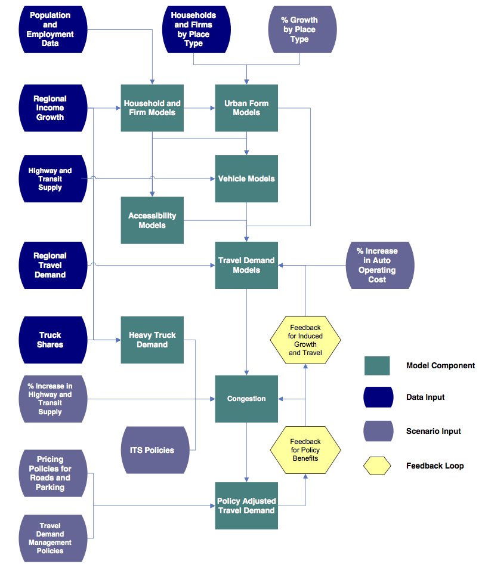
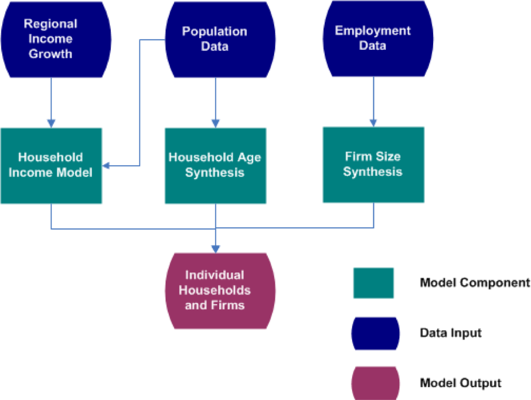
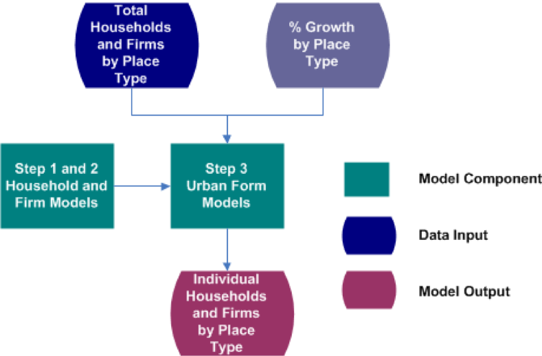

Introduction to the VERPAT model and its design.  

### Overview of the VERPAT modeling process

The diagram below illustrates the modeling system with inputs, model components, and feedback loops. Links are provided to the source code that implements each section.

**TODO: Check links -- are they correctly associated with bullets?**

<table>
  <tr>
    <td></td>
    <td> <ul> 
	<li> <a href="https://github.com/gregorbj/VisionEval/tree/master/sources/modules/VESimHouseholds"> Household Synthesis </a> </li>
	<li> <a href="https://github.com/gregorbj/VisionEval/tree/master/sources/modules/VESyntheticFirms"> Firm Synthesis </a> </li> 
	<li> <a href="https://github.com/gregorbj/VisionEval/tree/master/sources/modules/VELandUse"> Urban Form </a> </li>
	<li> <a href="https://github.com/gregorbj/VisionEval/tree/master/sources/modules/VETransportSupply"> Accessibility </a> </li>
	<li> <a href="https://github.com/gregorbj/VisionEval/tree/master/sources/modules/VEHouseholdVehicles"> Vehicle Models </a> </li>
	<li> <a href="https://github.com/gregorbj/VisionEval/tree/master/sources/modules/VEHouseholdTravel"> Auto Travel Demand </a> </li>
	<li> <a href="https://github.com/gregorbj/VisionEval/tree/master/sources/modules/VEHouseholdTravel"> Truck and Bus Travel Demand </a> </li>
	<li> <a href="https://github.com/gregorbj/VisionEval/tree/master/sources/modules/VETransportSupplyUse"> Congestion </a> </li>
	<li> <a href="https://github.com/gregorbj/VisionEval/tree/master/sources/modules/VEHouseholdTravel"> Induced Demand </a> </li> 
	<li> <a href="https://github.com/gregorbj/VisionEval/tree/master/sources/modules/VEHouseholdTravel"> Policy Benefits </a> </li> 
	</ul> </td>
  </tr>
</table>

+ Captures individual household and firm characteristics
+ Captures interactions between policies
+ Spatial results are by place type

For more, see [VERPAT Modules and Outputs](https://github.com/gregorbj/VisionEval/wiki/VERPAT-Modules-and-Outputs).

The following is an explanation of the major steps in the model execution shown above.

### Household and Firm Synthesis

[Households](https://github.com/gregorbj/VisionEval/tree/master/sources/modules/VESimHouseholds)
 
  + Person by Age (from census data)
  + Household income (from Bureau of Economic Analysis data)
  
[Firms](https://github.com/gregorbj/VisionEval/tree/master/sources/modules/VESyntheticFirms)

  + Employees
  + Industry (from County Business Pattern data)
  
Data can be updated from local sources

### Urban Form Models

Predicts place types

  + Area Types (4)
  + Development Patterns (4)
  
Based on households with 

  + Working age persons
  + Children
  + Seniors
  
Adjusted to fit regional totals

Modules are available in the [VELandUse package](https://github.com/gregorbj/VisionEval/tree/master/sources/modules/VELandUse).

### Accessibility

Inputs

  + Freeway lane miles
  + Transit revenue miles (annual bus and rail revenue miles per capita)
  
Outputs

  + Freeway lane miles per person
  + Transit revenue miles per person
  
Relates both transit and auto accessibility to travel behavior.  

Used in vehicle ownership models and vehicle miles traveled models.  

Modules are available in the [VETransportSupply package](https://github.com/gregorbj/VisionEval/tree/master/sources/modules/VETransportSupply).  

### Vehicle models

Predicts number of vehicles for each household

  + Autos
  + Bikes
  + Light trucks
  
Predicts vehicles by age/fuel efficiency

Based on 

  + Number of persons of driving age
  + Elderly persons
  + Household income
  + Population density
  + Freeway and transit supply
  + Urban mixed-use area

Modules are available in the [VEHouseholdVehicles package](https://github.com/gregorbj/VisionEval/tree/master/sources/modules/VEHouseholdVehicles).  

### Travel demand models

Predicts vehicle miles traveled for each household

  + Autos and light trucks
  + Heavy trucks
  + Buses and passenger rail
  
Based on

  + Household income
  + Population density
  + Number of household vehicles
  + Freeway and transit supply
  + Driving age persons in household
  + Elderly persons in household
  + Mixed use development
  
Truck VMT is based on changes in regional household income

Bus VMT is calculated from bus revenue miles

Modules are available in the [VEHouseholdTravel package](https://github.com/gregorbj/VisionEval/blob/master/sources/modules/VEHouseholdTravel).

### Accounting for congestion

Three aspects are represented:

  1. VMT is allocated to freeways and arterials by congestion level
  2. Speeds and fuel economies are calculated for freeways and arterials
  3. Congestion in local areas is estimated from increased activity
  
Congestion is part of a feedback loop between changes in each scenario and induced growth

Modules are available in the [VETransportSupplyUse package](https://github.com/gregorbj/VisionEval/tree/master/sources/modules/VETransportSupplyUse). 

### Induced demand

Definition: Additional demand resulting from adding transportation supply

Short term -- induced demand

  + Changes in road supply, function of speed
  + Potential mode and route shift
  
Long term -- induced growth: changes in growth patterns resulting from changes in travel patterns

Induced demand is calculated in the [VEHouseholdTravel package](https://github.com/gregorbj/VisionEval/tree/master/sources/modules/VEHouseholdTravel).

### Performance metrics

**TODO introduce bullet points**

Direct travel impacts

  + Daily VMT
  + Daily vehicle trips
  + Daily transity trips
  + Peak travel speeds by facility type
  + Vehicle hours of travel
  + Vehicle hours of delay
  
Community impacts

  + Public health impacts and costs
  + Equity impacts
  
Environment and energy impacts

  + Fuel consumption
  + Greenhouse gas emissions
  + Criteria emissions
  
Financial and economic impacts

  + Regional highway infrastructure costs
  + Regional transity infrastructure and operating costs
  + Annual traveler cost
  
Land market and location impacts

  + Regional accessibility
  
Performance metrics are calculated in the [VEReports package](https://github.com/gregorbj/VisionEval/tree/master/sources/modules/VEReports).  For more information, also see [VERPAT Modules and Outputs](https://github.com/gregorbj/VisionEval/wiki/VERPAT-Modules-and-Outputs#reportrpatmetrics).  
  
### For more information

  + [VisionEval Model System Design and Users Guide](https://github.com/gregorbj/VisionEval/blob/master/api/model_system_design.md)
  + [TravelWorks Rapid Policy Assessment Tool](https://planningtools.transportation.org/551/rapid-policy-analysis-tool.html)
  + [RPAT User manual](https://planningtools.transportation.org/files/63.pdf)

[top](https://github.com/gregorbj/VisionEval/wiki/VERPAT-Tutorial#table-of-contents)
