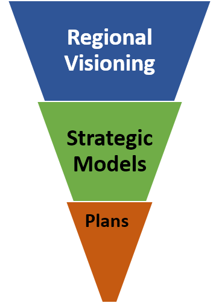

This section introduces scenario planning. What is it?  Why is it done?

### A definition of scenario planning

Scenario planning is a process to develop and analyze the future based on different assumptions about future uncertainties. A defining characteristic of successful public sector scenario planning is that it actively involves the public, the business community, and elected officials on a broad scale, educating them about growth trends and trade-offs, and incorporating their values and feedback into future plans. VERPAT is one of several analytical tools and models developed to support scenario planning.

### Scenario planning framework

Scenario planning provides a framework for developing a shared vision for the future by analyzing the various forces that affect growth

  + Health
  + Transportation
  + Economics
  + Environmental
  + Land use
  
### Benefits of scenario planning

  + Helps agencies align informed and strategic transportation decision-making with regional goals
  + Integrates regional transportation and local land use stakeholders to collectively better understand and visualize future transportation and land use patterns
  + Improves public and stakeholder involvement through coordinated outreach
  + Scenario planning software helps develop and assess scenarios and visualize the differences between alternatives
  + Broadens agency and public understanding by exploring future challenges and opportunities
### Scenario planning at FHWA/FTA

FHWA provides scenario planning technical assistance and guidebooks [here](https://www.fhwa.dot.gov/planning/scenario_and_visualization/scenario_planning/).  FHWA also offers  workshops, webinars, innovative uses and other resources to assist transportation agencies to support scenario planning for local, regional or statewide activities. 

+ [Peer Exchange Workshops](https://www.fhwa.dot.gov/planning/scenario_and_visualization/scenario_planning/peer_exchange/)
+ [FHWA Scenario Webinar](https://www.fhwa.dot.gov/planning/scenario_and_visualization/scenario_planning/scenario_planning_webinars/) 
+ [Noteworthy Practices and Innovative Uses](https://www.fhwa.dot.gov/planning/scenario_and_visualization/scenario_planning/scenpractices.cfm) 
+ [Publications and Resources](https://www.fhwa.dot.gov/planning/scenario_and_visualization/scenario_planning/publications/)
+ [Supporting Performance-Based Planning and Programming through Scenario Planning](https://www.fhwa.dot.gov/planning/scenario_and_visualization/scenario_planning/scenario_planning_guidebook/)

### Scenario planning is a data driven process

<table>
  <tr>
    <td> <ul> 
	<li> Understand critical decision points in the transportation planning process and how land use affects demand for transportation capacity</li>
	<li> Represent the dynamics and interrelationships of land use strategies with the performance of a transportation investment </li> 
	<li> Facilitate improved communication, interaction, and partnerships between decision-makers and planners in transportation and land use arenas </li>
	</ul> </td>
    <td> </td>
  </tr>
</table>

### Decision points for smart growth in the planning process

These process maps for state DOTs and MPOs highlight areas where smart growth levers can be used 

<table>
  <tr>
    <td> <ul> 
	<li> Policy studies </li>
	<li> Planning studies </li> 
	<li> Programming </li>
	<li> Implementation </li>
	</ul> </td>
    <td></td>
  </tr>
</table>

### Practitioner needs 

Most agencies are interested in scenario planning as a strategy to evaluate new policies for land use, pricing, new vehicle and information technologies and travel demand management. These are policies that are more difficult for most travel demand forecasting models. 

Many agencies need coordination, cooperation, and communication with local governments on land use policy, since land use regulations are governed by local governments. 

Agencies also want to understand 

  + Induced demand
  + Travel demand management
  + Urban form
  + Congestion reduction
  + Outcomes and performance
  
### Gaps in research

**TODO: More to say about this table?  Introduce it?**

| Topic                                            | Well-Established   Relationships         | Gaps in Research                                                                                                                                                  |
|:-------------------------------------------------|:--------------------------------------------|:------------------------------------------------------------------------------------------------------------------------------------------------------------------|
| Built environment impact on peak auto demand     | Impact on daily travel                      | Impact by time of day                                                                                                                                             |
| Mobility by mode and purpose                     | Impact on daily travel                      | Impact by trip purpose                                                                                                                                            |
| Induced traffic and induced growth               | Capacity expansion on an expanded facility  | Route shifts, time of day shifts, mode shifts, induced trips, new destinations, growth shifts on the network; effects of operational improvements, land use plans |
| Relationship between smart growth and congestion | Localized effects                           | Macro-level or regional effects                                                                                                                                   |
| Smart growth and freight                         | Freight is necessary for population centers | Impacts of loading docks, truck routing, full-cost pricing, freight facilities and crossings, inter-firm cooperation, stakeholder communication                   |

### Land Use Scenarios

**TODO: Introduce this table**

Built Environment: Location of population and employment by place type

| Development Type             | Urban Core | Close in Community | Suburban | Rural |
|------------------------------|:----------:|:------------------:|:--------:|:-----:|
| Residential                  | X          | X                  | X        |       |
| Employment                   | X          | X                  | X        |       |
| Mixed-use                    | X          | X                  | X        |       |
| Transit Oriented Development | X          | X                  | X        |       |
| Rural/Greenfield             |            |                    |          | X     |

Demand Management Policies

**TODO: Introduce bullets**

  + Vanpool
  + Telecommuting
  + Ridesharing
  + Transit pass programs
  
Measures

  + Proportion of population and employment by place type
  + Population and employment densities by place type

### Transportation scenarios

**TODO: Introduce these bullets**

Travel Demand

  + Changes in population demographics
  + Changes in personal income
  + Changes in firm size or industry
  + Auto and light truck proportions by year
  + Induced demand – short term impacts

Transportation Policies

  + Vehicle miles traveled charges
  + Parking pricing programs
  + Intelligent transportation system strategies for freeways and arterials

Transportation Supply

  + Amount of regional transit service
  + Amount of freeway and arterial capacity
  
### Strategic Models for Integrated Land Use and Transportation

**TODO Introduce these bullets**

  + Support strategic planning efforts
  + Consider many possible scenarios 
  + Combines higher level analysis of the transportation supply with individual characteristics of travel demand, built environment and policies
  + Growth by place type
  + Households (persons by age and income)
  + Firms (employees and industry)
  + Income growth
  + Truck and bus VMT
  + Accessibility
  + Congestion
  + Induced growth
  + Policy benefits
  + Easy to apply and run quickly

Strategic models bridge the gap between regional visioning and specific plans 

### Communicating Results

Evaluate scenarios across a range of performance metrics

  + Community Impacts
  + Travel Impacts
  + Environmental and Energy Impacts
  + Financial and Economic Impacts
  + Location Impacts

Compare multiple scenarios at a time graphically to quickly assess results

[[Overview | VERPAT-Tutorial-Overview]]
