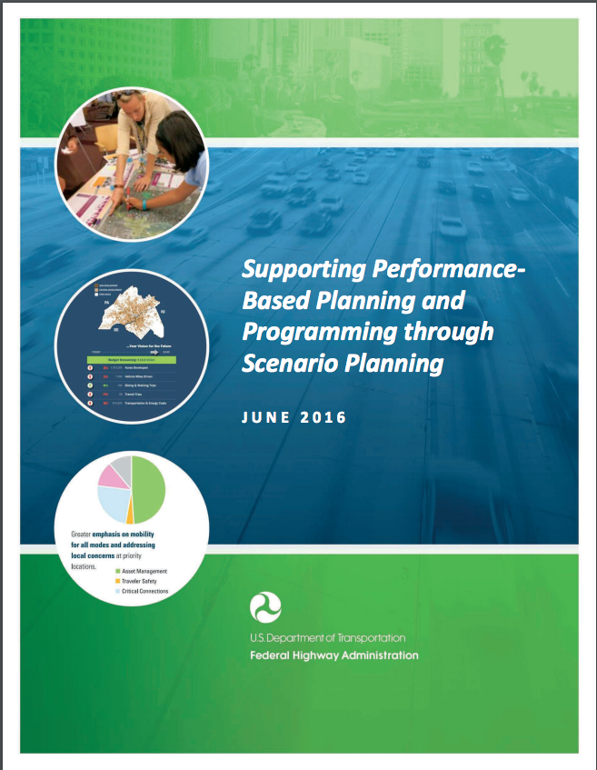
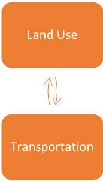
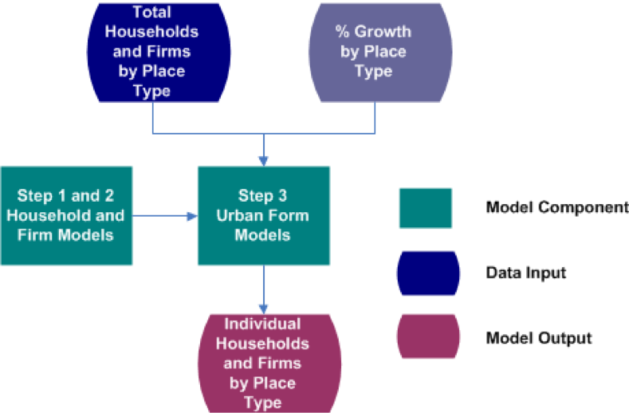

Contains the markdown for top sections at https://github.com/gregorbj/VisionEval/wiki/VERPAT-Tutorial

matt.landis@rsginc.com

## Overview

This tutorial describes the purpose, structure, and use of VERPAT (VisionEval Rapid Planning Assessment Tool), a model based on the VisionEval framework for strategic planning of transportation networks.

## Table of Contents

  + [Scenario Planning](https://github.com/gregorbj/VisionEval/wiki/VERPAT-Tutorial#scenario-planning)
  + [The VERPAT Model](https://github.com/gregorbj/VisionEval/wiki/VERPAT-Tutorial#the-verpat-model)
  + [Installation of VisionEval and VERPAT](https://github.com/gregorbj/VisionEval/wiki/VERPAT-Tutorial#installation-of-visioneval-and-verpat)
  + [Single Scenarios with VERPAT](https://github.com/gregorbj/VisionEval/wiki/VERPAT-Tutorial#single-scenarios-with-verpat)
  + [Multiple Scenarios with VERPAT](https://github.com/gregorbj/VisionEval/wiki/VERPAT-Tutorial#multiple-scenarios-with-verpat)
  + [Performance Metrics](https://github.com/gregorbj/VisionEval/wiki/VERPAT-Tutorial#performance-metrics)
  + [Bonus material](https://github.com/gregorbj/VisionEval/wiki/VERPAT-Tutorial#bonus-material)

## Scenario Planning

### A definition of scenario planning

A group of participants who are engaged in a data driven communication process that seeks to: 

  + Ask questions
  + Develop answers
  + Come to agreement on common problems and solutions

### Scenario planning framework

Scenario planning provides a framework for developing a shared vision for the future by analyzing the various forces that affect growth

  + Health
  + Transportation
  + Economics
  + Environmental
  + Land use
  
### Benefits of scenario planning

  + Helps agencies engage in a more informed and strategic transportation decision-making process
  + Used in conjunction with a charrette or chips games, can help stakeholders better understand and visualize future transportation and land use patterns
  + Scenario planning software programs can also help develop and assess scenarios, visualize the differences between alternatives, and encourage stakeholder participation

### Scenario planning at FHWA/FTA

<table>
  <tr>
    <td> <ul> 
	<li> Workshops and peer exchanges </li>
	<li> Webinar series to promote scenario planning </li> 
	<li> Innovative research </li>
    <li> Publications, case studies 
	     <ul> <li> Scenario planning guidebook: six-phases </li>
		      <li> State of the practice report: survey of MPOs on current practices </li>
	     </ul> </li>
	</ul> </td>
    <td>  </td>
  </tr>
</table>

### Needs for a data driven process

<table>
  <tr>
    <td> <ul> 
	<li> Understand critical decision points in the transportation planning process and how land use affects demand for transportation capacity</li>
	<li> Represent the dynamics and interrelationships of land use strategies with the performance of a transportation investment </li> 
	<li> Facilitate improved communication, interaction, and partnerships between decision-makers and planners in transportation and land use arenas </li>
	</ul> </td>
    <td> </td>
  </tr>
</table>

### Decision points for smart growth in planning process

Process maps for state DOTs and MPOs

Areas where smart growth levers can be used 

<table>
  <tr>
    <td> <ul> 
	<li> Policy studies </li>
	<li> Planning studies </li> 
	<li> Programming </li>
	<li> Implementation </li>
	</ul> </td>
    <td></td>
  </tr>
</table>

### Practioner information needs survey

**TODO: Explain title.  Is this section the results of a survey?**

Most agencies are interested in scenario planning as a strategy for evaluating land use policies

Many agencies need coordination, cooperation, and communication with local governments on land use policy, since land use regulations are governed by local governments

Agencies also want to understand 

  + Induced demand
  + Travel demand management
  + Urban form
  + Congestion reduction
  + Outcomes and performance
  
Develop a tool that can be used by land use and transportation planners to provide opportunities for interaction on common goals

### Gaps in research

**TODO: More to say about this table?  Introduce it?**

| Topic                                            | Well-Established   Relationships         | Gaps in Research                                                                                                                                                  |
|:-------------------------------------------------|:--------------------------------------------|:------------------------------------------------------------------------------------------------------------------------------------------------------------------|
| Built environment impact on peak auto demand     | Impact on daily travel                      | Impact by time of day                                                                                                                                             |
| Mobility by mode and purpose                     | Impact on daily travel                      | Impact by trip purpose                                                                                                                                            |
| Induced traffic and induced growth               | Capacity expansion on an expanded facility  | Route shifts, time of day shifts, mode shifts, induced trips, new destinations, growth shifts on the network; effects of operational improvements, land use plans |
| Relationship between smart growth and congestion | Localized effects                           | Macro-level or regional effects                                                                                                                                   |
| Smart growth and freight                         | Freight is necessary for population centers | Impacts of loading docks, truck routing, full-cost pricing, freight facilities and crossings, inter-firm cooperation, stakeholder communication                   |

### Land Use Scenarios

**TODO: Introduce this table**

Built Environment: Location of population and employment by place type

| Development Type             | Urban Core | Close in Community | Suburban | Rural |
|------------------------------|:----------:|:------------------:|:--------:|:-----:|
| Residential                  | X          | X                  | X        |       |
| Employment                   | X          | X                  | X        |       |
| Mixed-use                    | X          | X                  | X        |       |
| Transit Oriented Development | X          | X                  | X        |       |
| Rural/Greenfield             |            |                    |          | X     |

Demand Management Policies

**TODO: Introduce bullets**

  + Vanpool
  + Telecommuting
  + Ridesharing
  + Transit pass programs
  
Measures

  + Proportion of population and employment by place type
  + Population and employment densities by place type

### Transportation scenarios

**TODO: Introduce these bullets**

Travel Demand

  + Changes in population demographics
  + Changes in personal income
  + Changes in firm size or industry
  + Auto and light truck proportions by year
  + Induced demand – short term impacts

Transportation Policies

  + Vehicle miles traveled charges
  + Parking pricing programs
  + Intelligent transportation system strategies for freeways and arterials

Transportation Supply

  + Amount of regional transit service
  + Amount of freeway and arterial capacity
  
### Strategic Models for Integrated Land Use and Transportation

**TODO Introduce these bullets**

  + Support strategic planning efforts
  + Consider many possible scenarios 
  + Combines higher level analysis of the transportation supply with individual characteristics of travel demand, built environment and policies
  + Growth by place type
  + Households (persons by age and income)
  + Firms (employees and industry)
  + Income growth
  + Truck and bus VMT
  + Accessibility
  + Congestion
  + Induced growth
  + Policy benefits
  + Easy to apply and run quickly

Strategic models bridge the gap between regional visioning and specific plans 

### Communicating Results

Evaluate scenarios across a range of performance metrics

  + Community Impacts
  + Travel Impacts
  + Environmental and Energy Impacts
  + Financial and Economic Impacts
  + Location Impacts

Compare multiple scenarios at a time graphically to quickly assess results

[top](https://github.com/gregorbj/VisionEval/wiki/VERPAT-Tutorial#table-of-contents)

## The VERPAT Model
### Rapid Policy Assessment Tool Process

**TODO: Check links -- are they correctly associated with bullets?**

<table>
  <tr>
    <td></td>
    <td> <ul> 
	<li> <a href="https://github.com/gregorbj/VisionEval/tree/master/sources/modules/VESimHouseholds"> Household Synthesis </a> </li>
	<li> <a href="https://github.com/gregorbj/VisionEval/tree/master/sources/modules/VESyntheticFirms"> Firm Synthesis </a> </li> 
	<li> <a href="https://github.com/gregorbj/VisionEval/tree/master/sources/modules/VELandUse"> Urban Form </a> </li>
	<li> <a href="https://github.com/gregorbj/VisionEval/tree/master/sources/modules/VETransportSupply"> Accessibility </a> </li>
	<li> <a href="https://github.com/gregorbj/VisionEval/tree/master/sources/modules/VEHouseholdVehicles"> Vehicle Models </a> </li>
	<li> <a href="https://github.com/gregorbj/VisionEval/tree/master/sources/modules/VEHouseholdTravel"> Auto Travel Demand </a> </li>
	<li> <a href="https://github.com/gregorbj/VisionEval/tree/master/sources/modules/VEHouseholdTravel"> Truck and Bus Travel Demand </a> </li>
	<li> <a href="https://github.com/gregorbj/VisionEval/tree/master/sources/modules/VETransportSupplyUse"> Congestion </a> </li>
	<li> <a href="https://github.com/gregorbj/VisionEval/tree/master/sources/modules/VEHouseholdTravel"> Induced Demand </a> </li> 
	<li> <a href="https://github.com/gregorbj/VisionEval/tree/master/sources/modules/VEHouseholdTravel"> Policy Benefits </a> </li> 
	</ul> </td>
  </tr>
</table>

+ Captures individual household and firm characteristics
+ Captures interactions between policies
+ Spatial results are by place type

For more, see [VERPAT Modules and Outputs](https://github.com/gregorbj/VisionEval/wiki/VERPAT-Modules-and-Outputs).

### Household and Firm Synthesis

[Households](https://github.com/gregorbj/VisionEval/tree/master/sources/modules/VESimHouseholds)
 
  + Person by Age (from census data)
  + Household income (from Bureau of Economic Analysis data)
  
[Firms](https://github.com/gregorbj/VisionEval/tree/master/sources/modules/VESyntheticFirms)

  + Employees
  + Industry (from County Business Pattern data)
  
Data can be updated from local sources

### Urban Form Models

Predicts place types

  + Area Types (4)
  + Development Patterns (4)
  
Based on households with 

  + Working age persons
  + Children
  + Seniors
  
Adjusted to fit regional totals

Modules are available in the [VELandUse package](https://github.com/gregorbj/VisionEval/tree/master/sources/modules/VELandUse).

### Accessibility

Inputs

  + Freeway lane miles
  + Transit revenue miles (annual bus and rail revenue miles per capita)
  
Outputs

  + Freeway lane miles per person
  + Transit revenue miles per person
  
Relates both transit and auto accessibility to travel behavior.  

Used in vehicle ownership models and vehicle miles traveled models.  

Modules are available in the [VETransportSupply package](https://github.com/gregorbj/VisionEval/tree/master/sources/modules/VETransportSupply).  

### Vehicle models

Predicts number of vehicles for each household

  + Autos
  + Bikes
  + Light trucks
  
Predicts vehicles by age/fuel efficiency

Based on 

  + Number of persons of driving age
  + Elderly persons
  + Household income
  + Population density
  + Freeway and transit supply
  + Urban mixed-use area

Modules are available in the [VEHouseholdVehicles package](https://github.com/gregorbj/VisionEval/tree/master/sources/modules/VEHouseholdVehicles).  

### Travel demand models

Predicts vehicle miles traveled for each household

  + Autos and light trucks
  + Heavy trucks
  + Buses and passenger rail
  
Based on

  + Household income
  + Population density
  + Number of household vehicles
  + Freeway and transit supply
  + Driving age persons in household
  + Elderly persons in household
  + Mixed use development
  
Truck VMT is based on changes in regional household income

Bus VMT is calculated from bus revenue miles

Modules are available in the [VEHouseholdTravel package](https://github.com/gregorbj/VisionEval/blob/master/sources/modules/VEHouseholdTravel).

### Accounting for congestion

Three aspects are represented:

  1. VMT is allocated to freeways and arterials by congestion level
  2. Speeds and fuel economies are calculated for freeways and arterials
  3. Congestion in local areas is estimated from increased activity
  
Congestion is part of a feedback loop between changes in each scenario and induced growth

Modules are available in the [VETransportSupplyUse package](https://github.com/gregorbj/VisionEval/tree/master/sources/modules/VETransportSupplyUse). 

### Induced demand

Definition: Additional demand resulting from adding transportation supply

Short term -- induced demand

  + Changes in road supply, function of speed
  + Potential mode and route shift
  
Long term -- induced growth: changes in growth patterns resulting from changes in travel patterns

Induced demand is calculated in the [VEHouseholdTravel package](https://github.com/gregorbj/VisionEval/tree/master/sources/modules/VEHouseholdTravel).

### Performance metrics

**TODO introduce bullet points**

Direct travel impacts

  + Daily VMT
  + Daily vehicle trips
  + Daily transity trips
  + Peak travel speeds by facility type
  + Vehicle hours of travel
  + Vehicle hours of delay
  
Community impacts

  + Public health impacts and costs
  + Equity impacts
  
Environment and energy impacts

  + Fuel consumption
  + Greenhouse gas emissions
  + Criteria emissions
  
Financial and economic impacts

  + Regional highway infrastructure costs
  + Regional transity infrastructure and operating costs
  + Annual traveler cost
  
Land market and location impacts

  + Regional accessibility
  
Performance metrics are calculated in the [VEReports package](https://github.com/gregorbj/VisionEval/tree/master/sources/modules/VEReports).  For more information, also see [VERPAT Modules and Outputs](https://github.com/gregorbj/VisionEval/wiki/VERPAT-Modules-and-Outputs#reportrpatmetrics).  
  
### For more information

  + [VisionEval Model System Design and Users Guide](https://github.com/gregorbj/VisionEval/blob/master/api/model_system_design.md)
  + [TravelWorks Rapid Policy Assessment Tool](https://planningtools.transportation.org/551/rapid-policy-analysis-tool.html)
  + [RPAT User manual](https://planningtools.transportation.org/files/63.pdf)

[top](https://github.com/gregorbj/VisionEval/wiki/VERPAT-Tutorial#table-of-contents)
