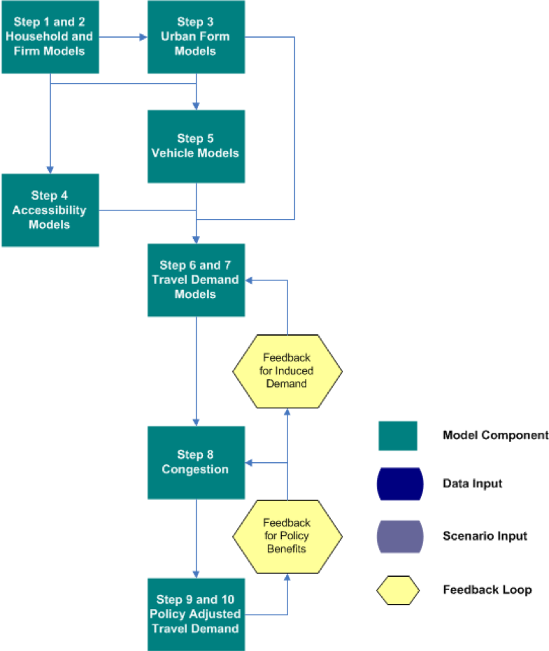

Currently under construction...

## Overview

This tutorial describes the purpose, structure, and use of VERPAT (VisionEval Rapid Planning Assessment Tool), a model based on the VisionEval framework for strategic planning of transportation networks.

## Table of Contents

## Scenario Planning

#### A definition of scenario planning

A group of participants who are engaged in a data driven communication process that seeks to: 

  + Ask questions
  + Develop answers
  + Come to agreement on common problems and solutions

#### Scenario planning framework

Scenario planning provides a framework for developing a shared vision for the future by analyzing the various forces that affect growth

  + Health
  + Transportation
  + Economics
  + Environmental
  + Land use
  
#### Benefits of scenario planning

Helps agencies engage in a more informed and strategic transportation decision-making process

Used in conjunction with a charrette or chips games, can help stakeholders better understand and visualize future transportation and land use patterns

Scenario planning software programs can also help develop and assess scenarios, visualize the differences between alternatives, and encourage stakeholder participation

#### Scenario planning at FHWA/FTA

  + Workshops and peer exchanges
  + Webinar series to promote scenario planning
  + Innovative research
  + Publications, case studies
    - Scenario planning guidebook: six-phases
    - State of the practice report: survey of MPOs on current practices

#### Needs for a data driven process

  + Understand critical decision points in the transportation planning process and how land use affects demand for transportation capacity
  + Represent the dynamics and interrelationships of land use strategies with the performance of a transportation investment
  + Facilitate improved communication, interaction, and partnerships between decision-makers and planners in transportation and land use arenas

  
#### Decision points for smart growth in planning process

Process maps for state DOTs and MPOs

Areas where smart growth levers can be used 

  + Policy studies
  + Planning studies
  + Programming
  + Implementation
  

#### Practioner information needs survey

Most agencies are interested in scenario planning as a strategy for evaluating land use policies

Many agencies need coordination, cooperation, and communication with local governments on land use policy, since land use regulations are governed by local governments

Agencies also want to understand 

  + Induced demand
  + Travel demand management
  + Urban form
  + Congestion reduction
  + Outcomes and performance
  
Develop a tool that can be used by land use and transportation planners to provide opportunities for interaction on common goals

#### Gaps in research

| Topic                        | Well-Established         | Gaps in Research                               |
|                              | Relationships            |                                                |
|:-----------------------------|:-------------------------|:-----------------------------------------------|
| Built environment impact on  | Impact on daily travel   | Impact by time of day                          |
| peak auto demand             |                          |                                                |
| Mobility by mode and purpose | Impact on daily travel   | Impact by trip purpose                         |
| Induced traffic and induced  | Capacity expansion on an | Route shifts, time of day shifts, mode shifts, |
| growth                       | expanded facility        | induced trips, new destinations, growth shifts |
|                              |                          | on the network; effects of operational         |
|                              |                          | improvements, land use plans                   |
| Relationship between smart   | Localized effects        | Macro-level or regional effects                |
| growth and congestion        |                          |                                                |
| Smart growth and freight     | Freight is necessary for | Impacts of loading docks, truck routing,       |
|                              | population centers       | full-cost pricing, freight facilities and      |
|                              |                          | crossings, inter-firm cooperation,             |
|                              |                          | stakeholder communication                                               |

#### Land Use Scenarios

Built Environment: Location of population and employment by place type

| Development Type             | Urban Core | Close in Community | Suburban | Rural |
| Residential                  | X          | X                  | X        |       |
| Employment                   | X          | X                  | X        |       |
| Mixed-use                    | X          | X                  | X        |       |
| Transit Oriented Development | X          | X                  | X        |       |
| Rural/Greenfield             |            |                    |          | X     |

Demand Management Policies

  + Vanpool
  + Telecommuting
  + Ridesharing
  + Transit pass programs
  
Measures

  + Proportion of population and employment by place type
  + Population and employment densities by place type

#### Transportation scenarios

Travel Demand

  + Changes in population demographics
  + Changes in personal income
  + Changes in firm size or industry
  + Auto and light truck proportions by year
  + Induced demand – short term impacts

Transportation Policies

  + Vehicle miles traveled charges
  + Parking pricing programs
  + Intelligent transportation system strategies for freeways and arterials

Transportation Supply

  + Amount of regional transit service
  + Amount of freeway and arterial capacity
  
#### Strategic Models for Integrated Land Use and Transportation

  + Support strategic planning efforts
  + Consider many possible scenarios 
  + Combines higher level analysis of the transportation supply with individual characteristics of travel demand, built environment and policies
  + Growth by place type
  + Households (persons by age and income)
  + Firms (employees and industry)
  + Income growth
  + Truck and bus VMT
  + Accessibility
  + Congestion
  + Induced growth
  + Policy benefits
  + Easy to apply and run quickly

Strategic models bridge the gap between regional visioning and specific plans

#### Communicating Results

Evaluate scenarios across a range of performance metrics

  + Community Impacts
  + Travel Impacts
  + Environmental and Energy Impacts
  + Financial and Economic Impacts
  + Location Impacts

Compare multiple scenarios at a time graphically to quickly assess results

TODO: insert graphic of output

## The VERPAT Model
#### Rapid Policy Assessment Tool Process

  1. Household Synthesis
  2. Firm Synthesis
  3. Urban Form
  4. Accessibility
  5. Vehicles
  6. Auto Travel Demand
  7. Truck and Bus Travel Demand
  8. Congestion
  9. Induced Demand
  10. Policy Benefits

+ Captures individual household and firm characteristics
+ Captures interactions between policies
+ Spatial results are by place type

#### Household and Firm Synthesis

Households
 
  + Person by Age (from census data)
  + Household income (from Bureau of Economic Analysis data)
  
Firms

  + Employees
  + Industry (from County Business Pattern data)
  
Data can be updated from local sources

#### Urban Form Models

Predicts place types

  + Area Types (4)
  + Development Patterns (4)
  
Based on households with 

  + Working age persons
  + Children
  + Seniors
  
Adjusted to fit regional totals

#### Accessibility

Inputs

  + Freeway lane miles
  + Transit revenue miles (annual bus and rail revenue miles per capita)
  
Outputs

  + Freeway lane miles per person
  + Transit revenue miles per person
  
Relates both transit and auto accessibility to travel behavior
Used in vehicle ownership models and vehicle miles traveled models

#### Vehicle models

Predicts number of vehicles for each household

  + Autos
  + Bikes
  + Light trucks
  
Predicts vehicles by age/fuel efficiency

Based on 

  + Number of persons of driving age
  + Elderly persons
  + Household income
  + Population density
  + Freeway and transit supply
  + Urban mixed-use area

#### Travel demand models

Predicts vehicle miles traveled for each household

  + Autos and light trucks
  + Heavy trucks
  + Buses and passenger rail
  
Based on

  + Household income
  + Population density
  + Number of household vehicles
  + Freeway and transit supply
  + Driving age persons in household
  + Elderly persons in household
  + Mixed use development
  
Truck VMT is based on changes in regional household income
Bus VMT is calculated from bus revenue miles

#### Accounting for congestion

Three aspects are represented:

  1. VMT is allocated to freeways and arterials by congestion level
  2. Speeds and fuel economies are calculated for freeways and arterials
  3. Congestion in local areas is estimated from increased activity
  
Congestion is part of a feedback loop between changes in each scenario and induced growth

#### Induced demand

Definition: Additional demand resulting from adding transportation supply

Short term -- induced demand

  + Changes in road supply, function of speed
  + Potential mode and route shift
  
Long term -- induced growth: changes in growth patterns resulting from changes in travel patterns

#### Performance metrics

Direct travel impacts

  + Daily VMT
  + Daily vehicle trips
  + Daily transity trips
  + Peak travel speeds by facility type
  + Vehicle hours of travel
  + Vehicle hours of delay
  
Community impacts

  + Public health impacts and costs
  + Equity impacts
  
Environment and energy impacts

  + Fuel consumption
  + Greenhouse gas emissions
  + Criteria emissions
  
Financial and economic impacts

  + Regional highway infrastructure costs
  + Regional transity infrastructure and operating costs
  + Annual traveler cost
  
Land market and location impacts

  + Regional accessibility
  

## Generating Scenarios with VERPAT

#### Sample scenarios

TODO: change this to the ones used in the repo
6 DCHC tested scenarios
  1. 2040 MTP - Baseline
  2. E+C: 18% reduction of roadway construction
  3. Hwy: 9.8% increase of roadway construction
  4. TRN: 276% rail mile increase, 12% bus mile reduction and 9.4% reduction of roadway construction
  5. Shift 15% growth to dense areas
  6. Shift 15% growth to dense areas with 15% lane mile ITS treatment
  
#### Create new scenario in VERPAT

TODO: Screenshots of this process.  Manually create CSV that changes parameters

#### Run scenario in VERPAT

TODO: Screenshots of process

#### Output directory in VERPAT

TODO: Screenshots
	
## Performance Metrics

#### Direct travel impacts

Daily vehicle trips

|                        | Description                      | Vehicle trip decrease |
|------------------------|----------------------------------|----------------------:|
| Density                | Household/Population density     | -0.043                |
| Diversity              | Land use mix (entropy)           | -0.051                |
| Design                 | Intersection/streen density      | -0.031                |
| Regional Accessibility | Job accessibility by auto        | -0.036                |
| Distance to transit    | Distance to nearest transit stop | 0                     |

Daily transit trips

|                        | Description                      | Transit trip increase |
|------------------------|----------------------------------|----------------------:|
| Density                | Household/Population density     |                  0.07 |
| Diversity              | Land use mix (entropy)           |                  0.12 |
| Design                 | Intersection/streen density      |                  0.23 |
| Regional Accessibility | Job accessibility by auto        |                     0 |
| Distance to transit    | Distance to nearest transit stop |                  0.29 |

  + Daily vehicle miles traveled
    - Light VMT for each household and place type
    - Regional VMT for heavy trucks and buses
  + Peak travel speeds by facility class
    - VMT by speed bin and class (freeway, arterial, other)
    - Average speeds by class
  + Vehicle hours of travel, delay
    - Vehicle hours of travel at free flow
    - Vehicle hours of travel in congestion
	
#### Energy impacts

Fuel consumption

  + calculated from VMT and fuel economy, split into fuel types
  + calculated for light vehicles, heavy trucks and buses
  
| Year | Auto       | Auto       | Lt. truck  | Lt. truck  | Gas        | Diesel     |
|      | Proportion | Proportion | Proportion | Proportion | Proportion | Proportion |
|      | Diesel     | CNG        | Diesel     | CNG        | Ethanol    | Biodiesel  |
|------|------------|------------|------------|------------|------------|------------|
| 1990 | 0.007      | 0          | 0.04       | 0          | 0          | 0          |
| 1995 | 0.007      | 0          | 0.04       | 0          | 0          | 0          |
| 2000 | 0.007      | 0          | 0.04       | 0          | 0          | 0          |
| 2005 | 0.007      | 0          | 0.04       | 0          | 0.1        | 0.01       |
| 2010 | 0.007      | 0          | 0.04       | 0          | 0.1        | 0.05       |
| 2015 | 0.007      | 0          | 0.04       | 0          | 0.1        | 0.05       |
| 2020 | 0.007      | 0          | 0.04       | 0          | 0.1        | 0.05       |

#### Environmental impacts

Greenhouse gas emissions

  + Light vehicles calculated by household
  + Regional heavy truck and transit emissions

| Fuel type                                               | Carbon intensity    |
|                                                         | (g per mega joule ) |
|---------------------------------------------------------|---------------------|
| Ultra-low sulfur diesel (USLD)                          | 77.19               |
| Biodiesel                                               | 76.81               |
| Reformulated gasoline (RFG)                             | 75.65               |
| CARBOB (gasoline formulated to be blended with ethanol) | 75.65               |
| Ethanol                                                 | 74.88               |
| Compressed natural gas (CNG)                            | 62.14               |

Criteria emissions

  + Emission rates from MOVES 2010a database
  + Volatile organic compounds (VOC)
  + Carbon monoxide (CO)
  + Oxides of nitrogen (NOx)
  + Sulfur dioxide (SO2)
  + Particulate matter (PM)

#### Financial & economic impacts

Regional highway infrastructure costs

  + FHWA Highway Economic Requirements System (HERS)
  + Construction costs per lane mile in 2002 dollars
  
| Functional                 |              | Small        | Large        |
| Classification             | Small Urban  | Urbanized    | Urbanized    |
|----------------------------|--------------|--------------|--------------|
| Freeways                   | $3.1 - $11.1 | $3.4 - $12.1 | $5.7 - $60.0 |
| Principal Arterial         | $2.6 - $9.4  | $2.9 - $10.2 | $4.2 - $15.0 |
| Minor Arterial / Collector | $2.0 - $7.0  | $2.1 - $7.4  | $2.9 - $10.2 |

Regional transit infrastructure and operating costs

  + National Transit Database (NTD)
  + Net cost to supply an unlinked passenger trip by mode (2009)
  
|               |              | Operating |            |              |          |
| Mode          | Capital Cost | Cost      | Total Cost | Fare Revenue | Net Cost |
|---------------|--------------|-----------|------------|--------------|----------|
| Bus           | $0.71        | $3.40     | $4.11      | $0.91        | $3.20    |
| Heavy Rail    | $1.78        | $1.80     | $3.58      | $1.09        | $2.49    |
| Commuter Rail | $5.74        | $9.80     | $15.54     | $4.69        | $10.85   |
| Light Rail    | $7.82        | $3.00     | $10.82     | $0.78        | $10.04   |

Annual traveler cost - fuel

  + $0.585 per mile in 2010 for auto users
  + Includes variable costs (gas, oil, maintenance and tires) and fixed costs (insurance, license, registration, taxes, depreciation and finance charges)
 
Annual travler cost - travel time

  + Urban Mobility Report (TTI)
  + Average travel delay for each metropolitan region
  + Only includes auto users
  
#### Location & community impacts

Relative increase in jobs accessibility by auto

  + Function of distribution of growth by place type
  + Weighted by population and employment growth
  
Livability

  + FTA criteria
  + Use of alternative modes
    - transit vehicle trips
	- bike ownership
  + Mixed use land use
    - mixed use place type
    - transit oriented development place type
  + Household transportation expenditures as a function of budget
  + Use of alternative modes by low income households
  
Equity impact

  + Regional accessibility by income group
  
#### Community impacts

Public health impacts and costs

  + Road safety impacts (daily VMT * 347 = annual VMT)
    - Fatal = 1.14 per 100 million VMT
	- Injury = 51.35 per 100 million VMT
	- Property damage = 133.95 per 100 million VMT
  + Amount of walking (proxy for physical fitness)
    | D                      | Description                       | Walking increase |
    |------------------------|-----------------------------------|------------------|
    | Density                | Household / Population density    | 0.07             |
    | Diversity              | Land use mix (entropy)            | 0.15             |
    | Design                 | Intersection / street density     | 0.39             |
    | Regional accessibility | Job accessibility by auto         | 0                |
    | Distance to transit    | Distanct to nearest transity stop | 0.15             |

  + Emissions (PM, NOX, VOC)
  
#### Visualizing performance metrics

VERPAT's charting is very easy to use and follows a template so each chart can be easily interpreted

In this example, **scenarios 3 and 8** have the highest reduction in vehicle hours of delay (23-24%) due to additional lane miles.  **Scenario 4** includes ITS treatments, which also reduce congestion a significant amount.

## Bonus material

#### VERPAT performance metrics in raw form

RDS files locations

