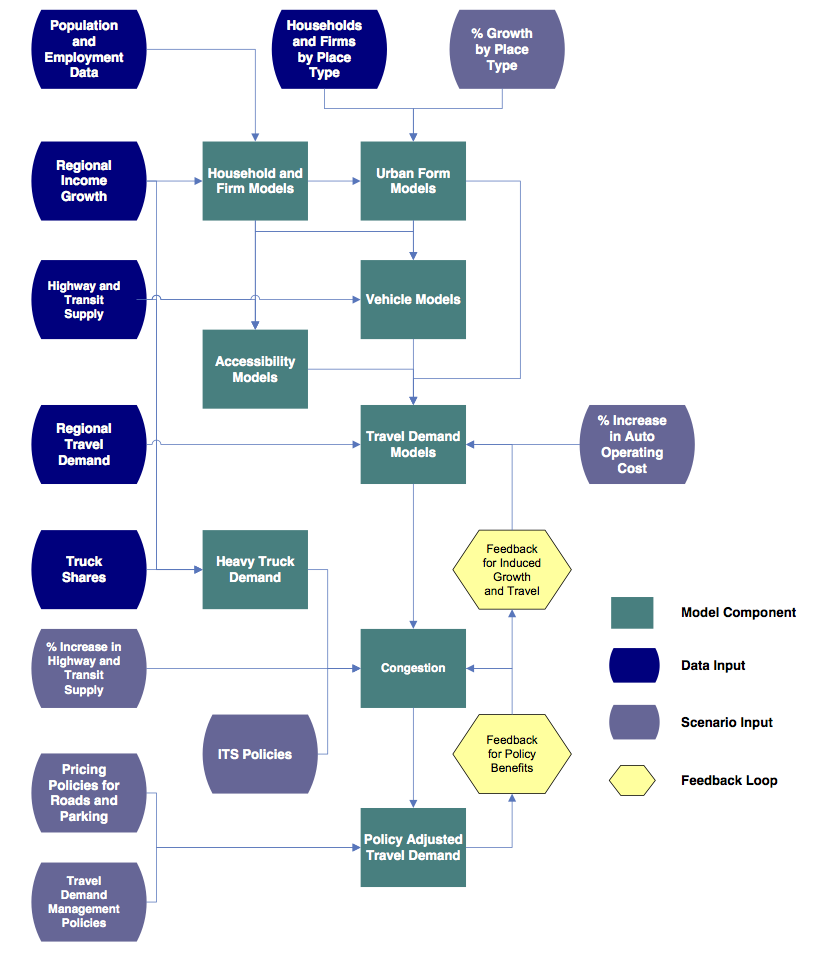

Currently under construction...

## Overview

This tutorial describes the purpose, structure, and use of VERPAT (VisionEval Rapid Planning Assessment Tool), a model based on the VisionEval framework for strategic planning of transportation networks.

## Table of Contents

[Scenario Planning](https://github.com/gregorbj/VisionEval/wiki/VERPAT-Tutorial#scenario-planning)

[The VERPAT Model](https://github.com/gregorbj/VisionEval/wiki/VERPAT-Tutorial#the-verpat-model)

[Installation of VisionEval and VERPAT](https://github.com/gregorbj/VisionEval/wiki/VERPAT-Tutorial#installation-of-visioneval-and-verpat) (include??)

[Single Scenarios with VERPAT](https://github.com/gregorbj/VisionEval/wiki/VERPAT-Tutorial#single-scenarios-with-verpat)

[Multiple Scenarios with VERPAT](https://github.com/gregorbj/VisionEval/wiki/VERPAT-Tutorial#multiple-scenarios-with-verpat)

[Performance Metrics](https://github.com/gregorbj/VisionEval/wiki/VERPAT-Tutorial#performance-metrics)

[Bonus material](https://github.com/gregorbj/VisionEval/wiki/VERPAT-Tutorial#bonus-material)

## Scenario Planning

### A definition of scenario planning

A group of participants who are engaged in a data driven communication process that seeks to: 

  + Ask questions
  + Develop answers
  + Come to agreement on common problems and solutions

### Scenario planning framework

Scenario planning provides a framework for developing a shared vision for the future by analyzing the various forces that affect growth

  + Health
  + Transportation
  + Economics
  + Environmental
  + Land use
  
### Benefits of scenario planning

  + Helps agencies engage in a more informed and strategic transportation decision-making process
  + Used in conjunction with a charrette or chips games, can help stakeholders better understand and visualize future transportation and land use patterns
  + Scenario planning software programs can also help develop and assess scenarios, visualize the differences between alternatives, and encourage stakeholder participation

### Scenario planning at FHWA/FTA

  + Workshops and peer exchanges
  + Webinar series to promote scenario planning
  + Innovative research
  + Publications, case studies
    - Scenario planning guidebook: six-phases
    - State of the practice report: survey of MPOs on current practices

<a href="https://www.fhwa.dot.gov/planning/scenario_and_visualization/scenario_planning/scenario_planning_guidebook/fhwahep16068.pdf">

</a>

### Needs for a data driven process

<table>
  <tr>
    <td> <ul> 
	<li> Understand critical decision points in the transportation planning process and how land use affects demand for transportation capacity</li>
	<li> Represent the dynamics and interrelationships of land use strategies with the performance of a transportation investment </li> 
	<li> Facilitate improved communication, interaction, and partnerships between decision-makers and planners in transportation and land use arenas </li>
	</ul> </td>
    <td> </td>
  </tr>
</table>

### Decision points for smart growth in planning process

Process maps for state DOTs and MPOs

Areas where smart growth levers can be used 


<table>
  <tr>
    <td> <ul> 
	<li> Policy studies </li>
	<li> Planning studies </li> 
	<li> Programming </li>
	<li> Implementation </li>
	</ul> </td>
    <td></td>
  </tr>
</table>

### Practioner information needs survey

**TODO: Explain title.  Is this section the results of a survey?**

Most agencies are interested in scenario planning as a strategy for evaluating land use policies

Many agencies need coordination, cooperation, and communication with local governments on land use policy, since land use regulations are governed by local governments

Agencies also want to understand 

  + Induced demand
  + Travel demand management
  + Urban form
  + Congestion reduction
  + Outcomes and performance
  
Develop a tool that can be used by land use and transportation planners to provide opportunities for interaction on common goals

### Gaps in research

**TODO: More to say about this table?  Introduce it?**

| Topic                                            | Well-Established <br> Relationships         | Gaps in Research                                                                                                                                                  |
|:-------------------------------------------------|:--------------------------------------------|:------------------------------------------------------------------------------------------------------------------------------------------------------------------|
| Built environment impact on peak auto demand     | Impact on daily travel                      | Impact by time of day                                                                                                                                             |
| Mobility by mode and purpose                     | Impact on daily travel                      | Impact by trip purpose                                                                                                                                            |
| Induced traffic and induced growth               | Capacity expansion on an expanded facility  | Route shifts, time of day shifts, mode shifts, induced trips, new destinations, growth shifts on the network; effects of operational improvements, land use plans |
| Relationship between smart growth and congestion | Localized effects                           | Macro-level or regional effects                                                                                                                                   |
| Smart growth and freight                         | Freight is necessary for population centers | Impacts of loading docks, truck routing, full-cost pricing, freight facilities and crossings, inter-firm cooperation, stakeholder communication                   |


### Land Use Scenarios

**TODO: Introduce this table**

Built Environment: Location of population and employment by place type

| Development Type             | Urban Core | Close in Community | Suburban | Rural |
|------------------------------|:----------:|:------------------:|:--------:|:-----:|
| Residential                  | X          | X                  | X        |       |
| Employment                   | X          | X                  | X        |       |
| Mixed-use                    | X          | X                  | X        |       |
| Transit Oriented Development | X          | X                  | X        |       |
| Rural/Greenfield             |            |                    |          | X     |

Demand Management Policies

TODO: Introduce bullets

  + Vanpool
  + Telecommuting
  + Ridesharing
  + Transit pass programs
  
Measures

  + Proportion of population and employment by place type
  + Population and employment densities by place type

### Transportation scenarios

**TODO: Introduce these bullets**

Travel Demand

  + Changes in population demographics
  + Changes in personal income
  + Changes in firm size or industry
  + Auto and light truck proportions by year
  + Induced demand – short term impacts

Transportation Policies

  + Vehicle miles traveled charges
  + Parking pricing programs
  + Intelligent transportation system strategies for freeways and arterials

Transportation Supply

  + Amount of regional transit service
  + Amount of freeway and arterial capacity
  
### Strategic Models for Integrated Land Use and Transportation

**TODO Introduce these bullets**

  + Support strategic planning efforts
  + Consider many possible scenarios 
  + Combines higher level analysis of the transportation supply with individual characteristics of travel demand, built environment and policies
  + Growth by place type
  + Households (persons by age and income)
  + Firms (employees and industry)
  + Income growth
  + Truck and bus VMT
  + Accessibility
  + Congestion
  + Induced growth
  + Policy benefits
  + Easy to apply and run quickly

Strategic models bridge the gap between regional visioning and specific plans 

### Communicating Results

Evaluate scenarios across a range of performance metrics

  + Community Impacts
  + Travel Impacts
  + Environmental and Energy Impacts
  + Financial and Economic Impacts
  + Location Impacts

Compare multiple scenarios at a time graphically to quickly assess results

TODO: insert graphic of output

[top](https://github.com/gregorbj/VisionEval/wiki/VERPAT-Tutorial#table-of-contents)


## The VERPAT Model
### Rapid Policy Assessment Tool Process

**TODO: Add links to modules**

<table>
  <tr>
    <td></td>
    <td> <ul> 
	<li> Household Synthesis </li>
	<li> Firm Synthesis </li> 
	<li> Urban Form </li>
	<li> Accessibility </li>
	<li> Vehicles </li>
	<li> Auto Travel Demand </li>
	<li> Truck and Bus Travel Demand </li>
	<li> Congestion </li>
	<li> Induced Demand </li> 
	<li> Policy Benefits </li> 
	</ul> </td>
  </tr>
</table>

+ Captures individual household and firm characteristics
+ Captures interactions between policies
+ Spatial results are by place type

### Household and Firm Synthesis

**TODO link to VERPAT modules**


Households
 
  + Person by Age (from census data)
  + Household income (from Bureau of Economic Analysis data)
  
Firms

  + Employees
  + Industry (from County Business Pattern data)
  
Data can be updated from local sources

### Urban Form Models

**TODO link to VERPAT modules**


Predicts place types

  + Area Types (4)
  + Development Patterns (4)
  
Based on households with 

  + Working age persons
  + Children
  + Seniors
  
Adjusted to fit regional totals

### Accessibility

**TODO link to VERPAT modules**

Inputs

  + Freeway lane miles
  + Transit revenue miles (annual bus and rail revenue miles per capita)
  
Outputs

  + Freeway lane miles per person
  + Transit revenue miles per person
  
Relates both transit and auto accessibility to travel behavior
Used in vehicle ownership models and vehicle miles traveled models

### Vehicle models

**TODO link to VERPAT modules**

Predicts number of vehicles for each household

  + Autos
  + Bikes
  + Light trucks
  
Predicts vehicles by age/fuel efficiency

Based on 

  + Number of persons of driving age
  + Elderly persons
  + Household income
  + Population density
  + Freeway and transit supply
  + Urban mixed-use area

### Travel demand models

**TODO link to VERPAT modules**

Predicts vehicle miles traveled for each household

  + Autos and light trucks
  + Heavy trucks
  + Buses and passenger rail
  
Based on

  + Household income
  + Population density
  + Number of household vehicles
  + Freeway and transit supply
  + Driving age persons in household
  + Elderly persons in household
  + Mixed use development
  
Truck VMT is based on changes in regional household income
Bus VMT is calculated from bus revenue miles

### Accounting for congestion

**TODO link to VERPAT modules**

Three aspects are represented:

  1. VMT is allocated to freeways and arterials by congestion level
  2. Speeds and fuel economies are calculated for freeways and arterials
  3. Congestion in local areas is estimated from increased activity
  
Congestion is part of a feedback loop between changes in each scenario and induced growth

### Induced demand

**TODO link to VERPAT modules**

Definition: Additional demand resulting from adding transportation supply

Short term -- induced demand

  + Changes in road supply, function of speed
  + Potential mode and route shift
  
Long term -- induced growth: changes in growth patterns resulting from changes in travel patterns

### Performance metrics

**TODO introduce bullet points**

Direct travel impacts

  + Daily VMT
  + Daily vehicle trips
  + Daily transity trips
  + Peak travel speeds by facility type
  + Vehicle hours of travel
  + Vehicle hours of delay
  
Community impacts

  + Public health impacts and costs
  + Equity impacts
  
Environment and energy impacts

  + Fuel consumption
  + Greenhouse gas emissions
  + Criteria emissions
  
Financial and economic impacts

  + Regional highway infrastructure costs
  + Regional transity infrastructure and operating costs
  + Annual traveler cost
  
Land market and location impacts

  + Regional accessibility
  

### For more information

  + [VisionEval Model System Design and Users Guide](https://github.com/gregorbj/VisionEval/blob/master/api/model_system_design.md)
  + [TravelWorks Rapid Policy Assessment Tool](https://planningtools.transportation.org/551/rapid-policy-analysis-tool.html)
  + [RPAT User manual](https://planningtools.transportation.org/files/63.pdf)

[top](https://github.com/gregorbj/VisionEval/wiki/VERPAT-Tutorial#table-of-contents)

## Installation of VisionEval and VERPAT

**TODO**

[top](https://github.com/gregorbj/VisionEval/wiki/VERPAT-Tutorial#table-of-contents)

## Single Scenarios with VERPAT

From the [Getting Started guide](https://github.com/gregorbj/VisionEval/wiki/Getting-Started) 

### Data background

Data are RPAT Pilot data for Multnomah County OR.  

**TODO: Is there a description of these data somewhere?**

### Run from R console

Open R using RStudio or Rgui
Set working directory to location containing `run_model.R`.  
`source` the file.

``` 
full_path <- "/Users/matt.landis/Git/VisionEval/sources/models/VERPAT"
setwd(full_path)
source("run_model.R")
```


### Run from VEGUI

**TODO: Include this?**

### Modifying the scenario

**TODO**

### Viewing output

**TODO**

[top](https://github.com/gregorbj/VisionEval/wiki/VERPAT-Tutorial#table-of-contents)

## Multiple Scenarios with VERPAT

The [VEScenarios module](https://github.com/gregorbj/VisionEval/tree/add_scenario/sources/modules/VEScenario) provides the capability to quickly set up, run, and visualize the results of large numbers of scenarios based on a base scenario and combinations of input changes.  

### Directory structure

The directory structure for a model set up for VEScenarios contains the following files:


  + defs
  + inputs
  + scenario_inputs
  + VERPAT_base_model
  + Visualizer
  + README.md
  + run_model.R
  
#### defs

TODO

#### inputs

TODO

#### scenario_inputs

Model scenarios are defined in terms of combinations of individual model input parameters and policy choices.  The various inputs are defined in the "scenario_inputs" folder.

Scenario inputs consist of six folders, one for each of a particular category of input, as described below.  All six folders are required.

Within each folder, there are subfolders containing input files, one per specific input. Each of the folders must contain at least one subfolder named "1", defining the input for the base scenario.  Subsequent numbered folders contain input files modifying parameters of interest, as shown in the screenshots below:

Model inputs not otherwise specified in the `scenario_inputs` directory are drawn from inputs in `VERPAT_model\defs` and `VERPAT_model\inputs`

TODO: Description of sample data used for illustration


The subfolder names and scenario inputs are defined as follows (input file to modify given in parentheses):

  - B - BikesOrLightVehicles (`region_light_vehicles.csv`)
    - 1 - Base TargetProp and PropSuitable
    - 2 - Double TargetProp and PropSuitable
  - C - Cost (`model_parameters.json`)
    - 1 - Base, no charge
    - 2 - 5 cents per mile
    - 3 - 9 cents per mile
  - D - DemandManagement (`region_commute_options.csv`)
    - 1 - Base
    - 2 - Double all participation rates	
    - 3 - Double all participation rates and transit subsidy level
  - L - LandUse (`bzone_pop_emp_prop.csv`)
    - 1 - Base, growth proportions same as base proportions
    - 2 - Half suburban population and employment growth (-20%, -15%), distribute to urban core R/E (+5%, +3.75%), urban core MU (+10%, +7.5%), and close in communities R/E (+5%, +3.75%)
  - P - ParkingGrowth (`marea_parking_growth.csv`)
    - 1 - Base, existing costs and proportions paid
    - 2 - Increase parking fees to 20% of workforce and 20% of other
    - 3 - Same as 2 but double parking cost
  - T - TransportationSupply (`model_parameters.json`)
    - 1 - Base, supply stays at present level
    - 2 - Double transit supply
    - 3 - Triple transit supply

Running all of these input values will result in 324 total scenarios, which will take several hours to half a day to run.  

To test, reduce the number of scenario inputs by deleting the numbered folders, making sure to retain the "1" folder for each of the six options.  

A reasonable test would be to use two scenarios for Bikes or Light Vehicles (B) and three scenarios for Cost (C), resulting in six scenarios.


  


#### VERPAT_base_model

The `VERPAT_base_model` folder contains inputs and R script necessary to run the base scenario.  The `defs` folder holds the [model definition files](https://github.com/gregorbj/VisionEval/wiki/VERPAT-Inputs-and-Parameters#model-definition-files)while the `inputs` folder contains [inputs and parameters](https://github.com/gregorbj/VisionEval/wiki/VERPAT-Inputs-and-Parameters#input-files) needed for the modules.  The `run_model.R` script calls each of the VERPAT modules in turn.  

#### Visualizer


The `Visualizer` folder contains the HTML, CSS, and javascript libraries needed for displaying the output of the VEScenarios module.  


### Create and run combinations

The `run_model.R` script will automatically create the scenarios from all combinations of policy inputs and run them using multiple processors.  Be sure to specify the number of processors to use, known as the `NWorkers` parameter in the file `sources/models/VERPAT_Scenarios/defs/model_parameters.json`.   Here I am using 4 processors (the default).


The model automatically builds and runs scenarios based on combinations of the policy inputs.  These are found in the `scenarios` folder.


Each folder contains the results of a model run, with its own inputs, datastore, and log file.


When finished, the VERPAT Scenario Viewer will automatically open to display the results.  


### Modify policies

TODO: Show how to modify the number of different policy alternatives are being explored.  

TODO: Show how to modify the policy alternatives themselves.


### View output			

TODO: See Instructions on VE_ScenarioViewer 

TODO: screenshots of selecting desired performance metrics to illustrate which scenarios contribute

### Accessing the data

TODO: Where are the output data stored?  How does one access them?

[top](https://github.com/gregorbj/VisionEval/wiki/VERPAT-Tutorial#table-of-contents)
	
## Performance Metrics

**TODO: Update these tables for current data**

### Direct travel impacts

Daily vehicle trips

|                        | Description                      | Vehicle trip decrease |
|------------------------|----------------------------------|----------------------:|
| Density                | Household/Population density     | -0.043                |
| Diversity              | Land use mix (entropy)           | -0.051                |
| Design                 | Intersection/streen density      | -0.031                |
| Regional Accessibility | Job accessibility by auto        | -0.036                |
| Distance to transit    | Distance to nearest transit stop | 0                     |

Daily transit trips

|                        | Description                      | Transit trip increase |
|------------------------|----------------------------------|----------------------:|
| Density                | Household/Population density     |                  0.07 |
| Diversity              | Land use mix (entropy)           |                  0.12 |
| Design                 | Intersection/streen density      |                  0.23 |
| Regional Accessibility | Job accessibility by auto        |                     0 |
| Distance to transit    | Distance to nearest transit stop |                  0.29 |

  + Daily vehicle miles traveled
    - Light VMT for each household and place type
    - Regional VMT for heavy trucks and buses
  + Peak travel speeds by facility class
    - VMT by speed bin and class (freeway, arterial, other)
    - Average speeds by class
  + Vehicle hours of travel, delay
    - Vehicle hours of travel at free flow
    - Vehicle hours of travel in congestion
	
### Energy impacts

Fuel consumption

  + calculated from VMT and fuel economy, split into fuel types
  + calculated for light vehicles, heavy trucks and buses
  
| Year | Auto <br> Proportion <br> Diesel | Auto <br> Proportion <br> CNG | Lt. truck <br> Proportion <br> Diesel  | Lt. truck <br> Proportion <br> CNG | Gas <br> Proportion <br> Ethanol    | Diesel <br> Proportion <br> Biodiesel   |
|------|------------|------------|------------|------------|------------|------------|
| 1990 | 0.007      | 0          | 0.04       | 0          | 0          | 0          |
| 1995 | 0.007      | 0          | 0.04       | 0          | 0          | 0          |
| 2000 | 0.007      | 0          | 0.04       | 0          | 0          | 0          |
| 2005 | 0.007      | 0          | 0.04       | 0          | 0.1        | 0.01       |
| 2010 | 0.007      | 0          | 0.04       | 0          | 0.1        | 0.05       |
| 2015 | 0.007      | 0          | 0.04       | 0          | 0.1        | 0.05       |
| 2020 | 0.007      | 0          | 0.04       | 0          | 0.1        | 0.05       |


### Environmental impacts

Greenhouse gas emissions

  + Light vehicles calculated by household
  + Regional heavy truck and transit emissions

| Fuel type                                               | Carbon intensity <br> (g per mega joule ) |
|---------------------------------------------------------|---------------------|
| Ultra-low sulfur diesel (USLD)                          | 77.19               |
| Biodiesel                                               | 76.81               |
| Reformulated gasoline (RFG)                             | 75.65               |
| CARBOB (gasoline formulated to be blended with ethanol) | 75.65               |
| Ethanol                                                 | 74.88               |
| Compressed natural gas (CNG)                            | 62.14               |

Criteria emissions

  + Emission rates from MOVES 2010a database
  + Volatile organic compounds (VOC)
  + Carbon monoxide (CO)
  + Oxides of nitrogen (NOx)
  + Sulfur dioxide (SO2)
  + Particulate matter (PM)

### Financial & economic impacts

Regional highway infrastructure costs

  + FHWA Highway Economic Requirements System (HERS)
  + Construction costs per lane mile in 2002 dollars
  
| Functional <br> Classification  | Small Urban | Small <br> Urbanized | Large <br> Urbanized      |
|----------------------------|--------------|--------------|--------------|
| Freeways                   | $3.1 - $11.1 | $3.4 - $12.1 | $5.7 - $60.0 |
| Principal Arterial         | $2.6 - $9.4  | $2.9 - $10.2 | $4.2 - $15.0 |
| Minor Arterial / Collector | $2.0 - $7.0  | $2.1 - $7.4  | $2.9 - $10.2 |

Regional transit infrastructure and operating costs

  + National Transit Database (NTD)
  + Net cost to supply an unlinked passenger trip by mode (2009)
  
| Mode          | Capital Cost | Operating <br> Cost      | Total Cost | Fare Revenue | Net Cost |
|---------------|--------------|-----------|------------|--------------|----------|
| Bus           | $0.71        | $3.40     | $4.11      | $0.91        | $3.20    |
| Heavy Rail    | $1.78        | $1.80     | $3.58      | $1.09        | $2.49    |
| Commuter Rail | $5.74        | $9.80     | $15.54     | $4.69        | $10.85   |
| Light Rail    | $7.82        | $3.00     | $10.82     | $0.78        | $10.04   |

Annual traveler cost - fuel

  + $0.585 per mile in 2010 for auto users
  + Includes variable costs (gas, oil, maintenance and tires) and fixed costs (insurance, license, registration, taxes, depreciation and finance charges)
 
Annual travler cost - travel time

  + Urban Mobility Report (TTI)
  + Average travel delay for each metropolitan region
  + Only includes auto users
  
### Location & community impacts

Relative increase in jobs accessibility by auto

  + Function of distribution of growth by place type
  + Weighted by population and employment growth
  
Livability

  + FTA criteria
  + Use of alternative modes
    - transit vehicle trips
	- bike ownership
  + Mixed use land use
    - mixed use place type
    - transit oriented development place type
  + Household transportation expenditures as a function of budget
  + Use of alternative modes by low income households
  
Equity impact

  + Regional accessibility by income group
  
### Community impacts

Public health impacts and costs

  + Road safety impacts (daily VMT * 347 = annual VMT)
    - Fatal = 1.14 per 100 million VMT
	- Injury = 51.35 per 100 million VMT
	- Property damage = 133.95 per 100 million VMT
  + Amount of walking (proxy for physical fitness)
  
    | D                      | Description                       | Walking increase |
    |------------------------|-----------------------------------|------------------|
    | Density                | Household / Population density    | 0.07             |
    | Diversity              | Land use mix (entropy)            | 0.15             |
    | Design                 | Intersection / street density     | 0.39             |
    | Regional accessibility | Job accessibility by auto         | 0                |
    | Distance to transit    | Distanct to nearest transity stop | 0.15             |

  + Emissions (PM, NOX, VOC)
  
### Visualizing performance metrics

**TODO:  UPdate this for VERPAT!**


VERPAT's charting is very easy to use and follows a template so each chart can be easily interpreted

In this example, **scenarios 3 and 8** have the highest reduction in vehicle hours of delay (23-24%) due to additional lane miles.  **Scenario 4** includes ITS treatments, which also reduce congestion a significant amount.

[top](https://github.com/gregorbj/VisionEval/wiki/VERPAT-Tutorial#table-of-contents)

## Bonus material

### VERPAT performance metrics in raw form

**TODO**

RDS files locations

[top](https://github.com/gregorbj/VisionEval/wiki/VERPAT-Tutorial#table-of-contents)


	
