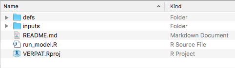
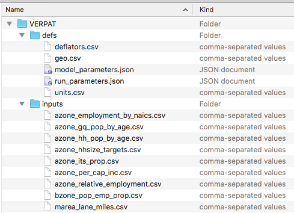
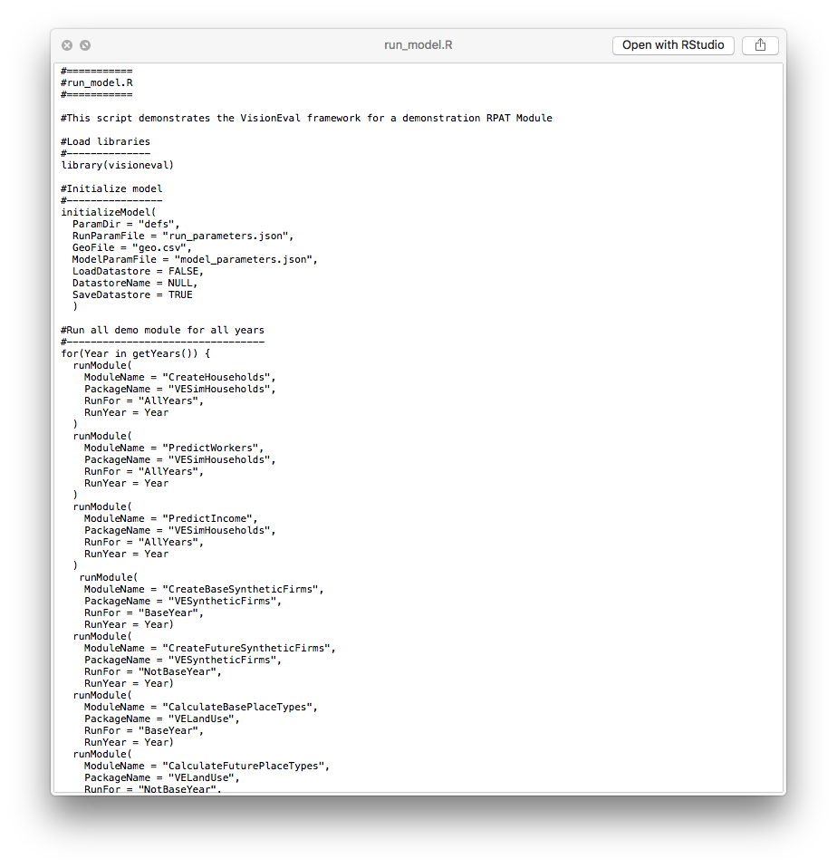
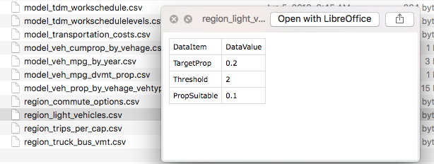
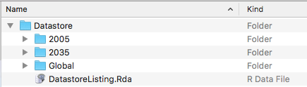
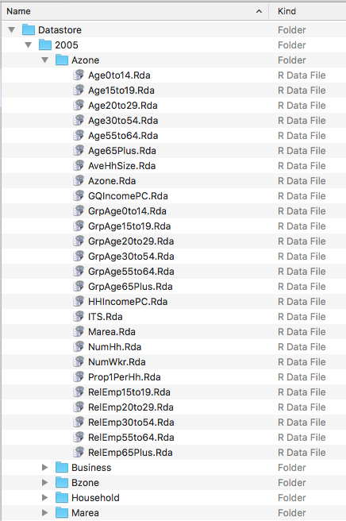
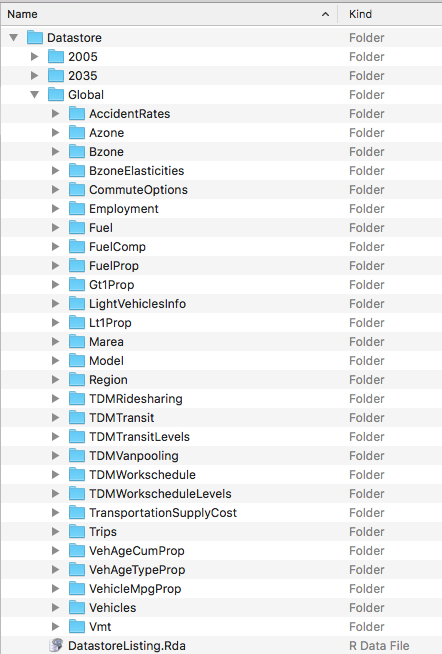

TODO: Intro to this section

## Installation of VisionEval and VERPAT

See [Getting Started: Installation and Setup](https://github.com/gregorbj/VisionEval/wiki/Getting-Started#installation-and-setup). That document describes the installation of the VisionEval framework as well as the VERPAT model itself. 

[top](https://github.com/gregorbj/VisionEval/wiki/VERPAT-Tutorial#table-of-contents)

## Running the VERPAT model

Once VisionEval and VERPAT have been installed, a model directory with sample data for Multnomah County, Oregon will be present at `VisionEval/sources/models/VERPAT`. This directory contains two subdirectories and several files:

The `defs` directory contains five [model definition files](https://github.com/gregorbj/VisionEval/wiki/VERPAT-Inputs-and-Parameters#model-definition-files), also described in the [Model System Design document](https://github.com/gregorbj/VisionEval/blob/master/api/model_system_design.md#61-model-directory-structure).  

The `inputs` directory contains a number of CSV and JSON files that describe the properties for the model.  Each module specifies what input files it needs.  These are described in [Input Files](https://github.com/gregorbj/VisionEval/wiki/VERPAT-Inputs-and-Parameters#input-files) and in the [Model System Design document](https://github.com/gregorbj/VisionEval/blob/master/api/model_system_design.md#64-model-inputs).  

To change the conditions in the model, these input files are modified (see [Modifying the scenario](#modifying-the-scenario)). 

The `run_model.R` file is described in the [Model System Design document](https://github.com/gregorbj/VisionEval/blob/master/api/model_system_design.md#5-model-system-layers) and consists of calls to the modules that make up the model. 

To run this file in R, see instructions at [Getting Started: Running VE Models](https://github.com/gregorbj/VisionEval/wiki/Getting-Started#running-ve-models).  That page describes running VERPAT via both the [R console](https://github.com/gregorbj/VisionEval/wiki/Getting-Started#running-verpat-or-verspm-from-within-r) and using [VEGUI](https://github.com/gregorbj/VisionEval/wiki/Getting-Started#running-vegui-from-github-to-run-verpat-or-verspm).   

### Modifying the scenario

To modify a scenario, the appropriate input files are edited.  For example, to increase bicycle usage, the file [`inputs/region_light_vehicles.csv`](https://github.com/gregorbj/VisionEval/wiki/VERPAT-Inputs-and-Parameters#region_light_vehiclescsv) would be modified in Excel, LibreOffice, or a text editor to change the `DataValue` of `TargetProp` from 0.2 to 0.4:

### Viewing output

The output data are contained in a *datastore*, which can be either an HDF5 file or a directory of RData files.  The datastore is described in detail in the [Model System Design document](https://github.com/gregorbj/VisionEval/blob/master/api/model_system_design.md#65-the-datastore).  

In this case, the datastore is a directory of RData files. It has a hierarchical structure, with directories for each year that the model is run, plus a `Global` folder for output that is not year specific.  

The year directories contain subdirectories for each geographic level, containing RData files.

The Global directory contains data that do not vary by model run year such as model parameters or geographic tables.

**TODO: Are there functions for viewing output?**

[top](https://github.com/gregorbj/VisionEval/wiki/VERPAT-Tutorial#table-of-contents)
