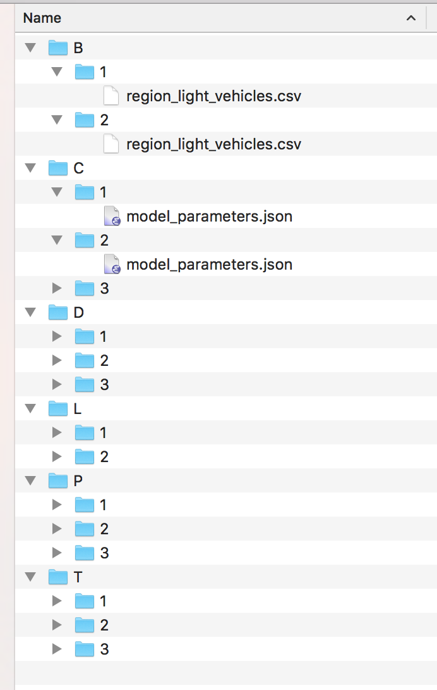
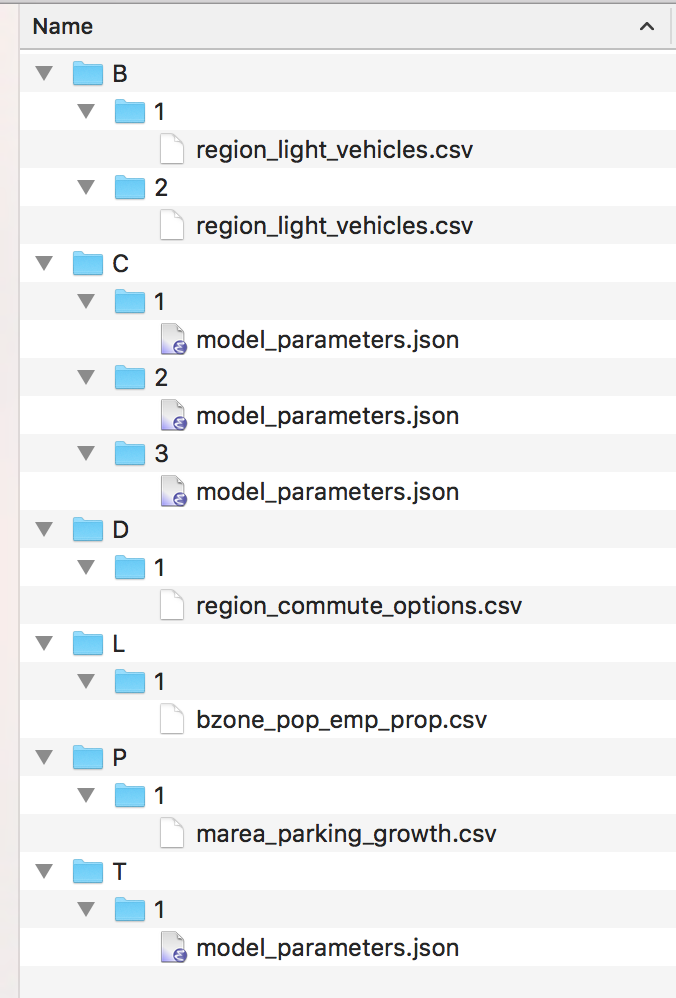
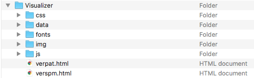
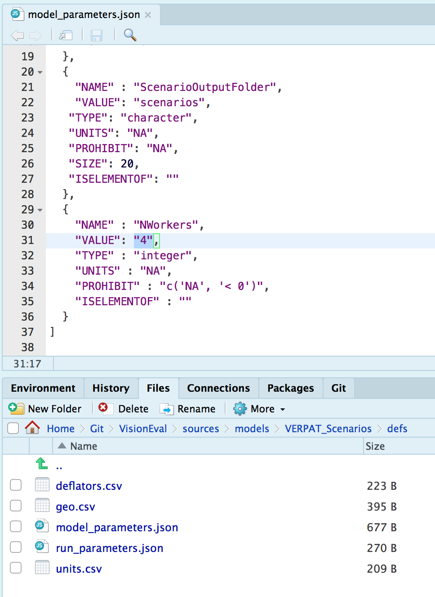
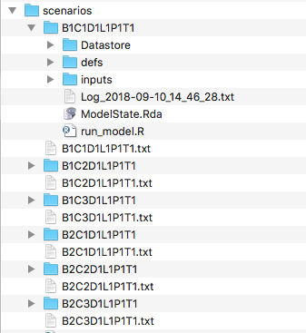
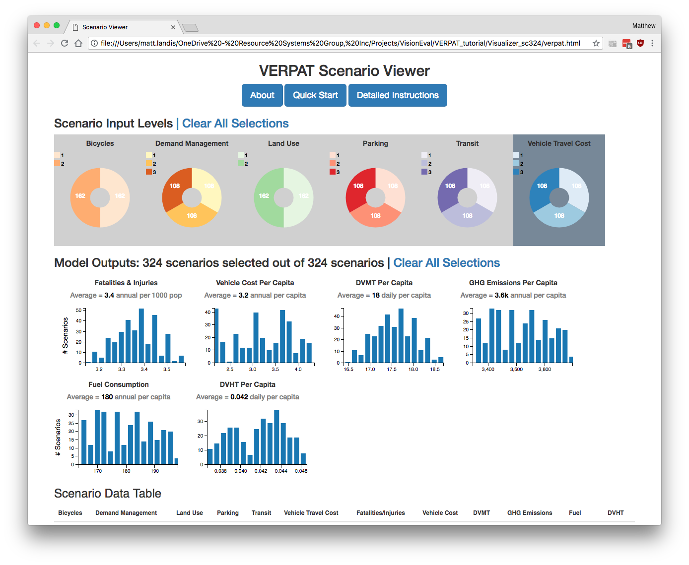
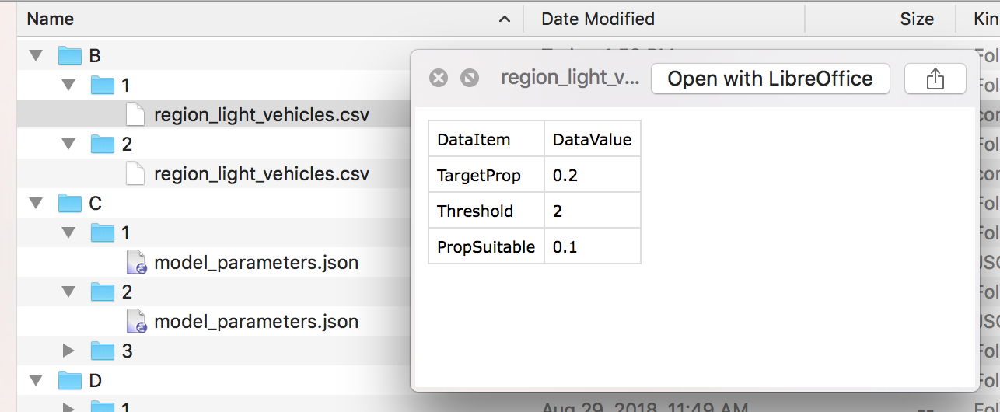
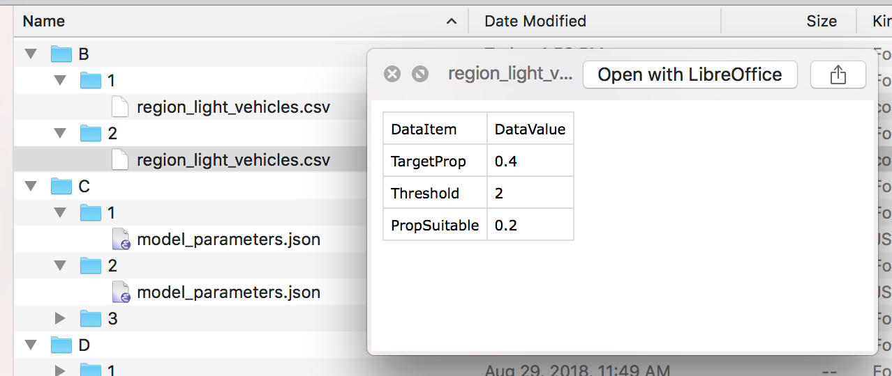
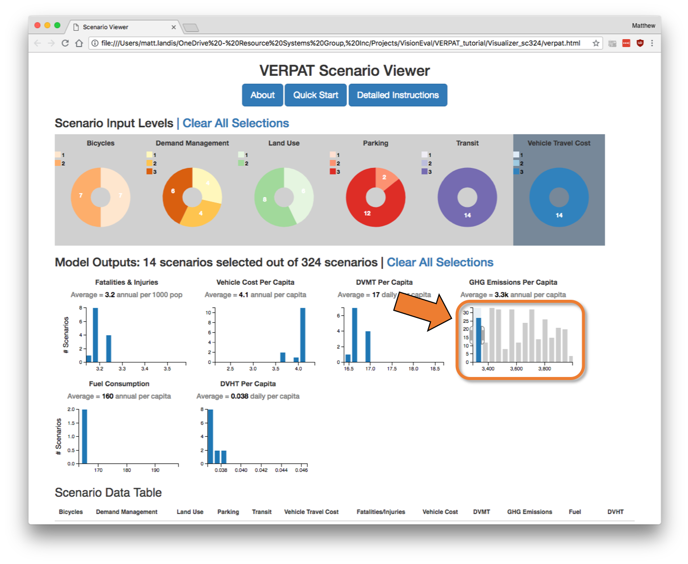
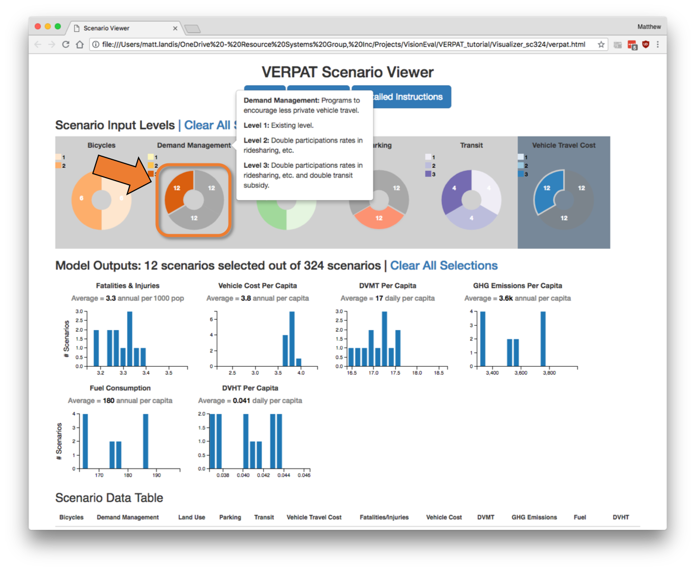

## Multiple Scenarios with VERPAT

The [VEScenarios module](https://github.com/gregorbj/VisionEval/tree/add_scenario/sources/modules/VEScenario) provides the capability to quickly set up, run, and visualize large numbers of scenarios based on a base scenario and combinations of input changes.  The VEScenarios module and a model directory (`VERPAT_Scenarios`) with sample data for Multnomah County, Oregon, are automatically installed when following the instructions [above](#installation-of-visioneval-and-verpat).  

### Directory structure

The directory structure for `VERPAT_Scenarios` contains the following files and directories:


#### VERPAT_base_model

The `VERPAT_base_model` directory contains the inputs and R script necessary to run the base scenario, as described above ([Running the VERPAT Model](#running-the-verpat-model)).  

The `defs` folder holds the [model definition files](https://github.com/gregorbj/VisionEval/wiki/VERPAT-Inputs-and-Parameters#model-definition-files) while the `inputs` folder contains [inputs and parameters](https://github.com/gregorbj/VisionEval/wiki/VERPAT-Inputs-and-Parameters#input-files) needed for the modules.  The `run_model.R` script calls each of the VERPAT modules in turn.  

#### defs

The `VERPAT_Scenarios/defs` directory contains the same files as the `VERPAT_base_model/defs` directory:


but the `model_parameters.json` file differs between `VERPAT_base_model/defs` and `VERPAT_Scenarios/defs` in that the latter version contains just four parameters specifying the locations of inputs and outputs, as well as the number of processors (`NWorkers`) to use:

```
[
  {
    "NAME": "ModelFolder",
    "VALUE": "VERPAT_base_model",
    "TYPE": "character",
    "UNITS": "NA",
    "PROHIBIT": "NA",
    "SIZE": 20,
    "ISELEMENTOF": ""
  },
  {
    "NAME": "ScenarioInputFolder",
    "VALUE": "scenario_inputs",
    "TYPE": "character",
    "UNITS": "NA",
    "PROHIBIT": "NA",
    "SIZE": 20,
    "ISELEMENTOF": ""
  },
  {
    "NAME" : "ScenarioOutputFolder",
    "VALUE": "scenarios",
   "TYPE": "character",
   "UNITS": "NA",
   "PROHIBIT": "NA",
   "SIZE": 20,
   "ISELEMENTOF": ""
  },
  {
    "NAME" : "NWorkers",
    "VALUE": "4",
    "TYPE" : "integer",
    "UNITS" : "NA",
    "PROHIBIT" : "c('NA', '< 0')",
    "ISELEMENTOF" : ""
  }
]
```


#### inputs

The `inputs` folder in `VERPAT_Scenarios` also differs from that in `VERPAT`.  In this case, there is only a single file specifying the output data tables that should be exported.  **TODO: what does "exported" mean in this case?**.


#### scenario_inputs

Model scenarios are defined in terms of combinations of individual model input parameters and policy choices.  The various inputs are defined in the `scenario_inputs` folder.

Scenario inputs consist of six folders, one for each of a particular category of input, as described below.  All six folders are required.

Within each folder, there are subfolders containing input files, one per specific input. Each of the folders must contain at least one subfolder named "1", defining the input for the base scenario.  Subsequent numbered folders contain input files modifying parameters of interest, as shown in the screenshots below:

Model inputs not otherwise specified in the `scenario_inputs` directory are drawn from inputs in `VERPAT_base_model/defs` and `VERPAT_base_model/inputs`



The subfolder names and scenario inputs are defined as follows (input file to modify given in parentheses):

  - B - BikesOrLightVehicles (`region_light_vehicles.csv`)
    - 1 - Base TargetProp and PropSuitable
    - 2 - Double TargetProp and PropSuitable
  - C - Cost (`model_parameters.json`)
    - 1 - Base, no charge
    - 2 - 5 cents per mile
    - 3 - 9 cents per mile
  - D - DemandManagement (`region_commute_options.csv`)
    - 1 - Base
    - 2 - Double all participation rates	
    - 3 - Double all participation rates and transit subsidy level
  - L - LandUse (`bzone_pop_emp_prop.csv`)
    - 1 - Base, growth proportions same as base proportions
    - 2 - Half suburban population and employment growth (-20%, -15%), distribute to urban core R/E (+5%, +3.75%), urban core MU (+10%, +7.5%), and close in communities R/E (+5%, +3.75%)
  - P - ParkingGrowth (`marea_parking_growth.csv`)
    - 1 - Base, existing costs and proportions paid
    - 2 - Increase parking fees to 20% of workforce and 20% of other
    - 3 - Same as 2 but double parking cost
  - T - TransportationSupply (`model_parameters.json`)
    - 1 - Base, supply stays at present level
    - 2 - Double transit supply
    - 3 - Triple transit supply

Running all of these input values will result in 324 total scenarios, which will take several hours to half a day to run.  

To test the multi-scenario capability in less time, reduce the number of scenario inputs by deleting the numbered folders, making sure to retain the "1" folder for each of the six options.  

A reasonable test would be to generate six scenarios: use two scenarios for Bikes or Light Vehicles (B) and three scenarios for Cost (C):




#### Visualizer

The `Visualizer` folder contains the HTML, CSS, and javascript libraries needed for displaying the output of the VEScenarios module.  




#### run_model.R

The `run_model.R` script in this case runs four modules that create the scenarios from the inputs, runs each, combines the results, and visualizes them using the `Visualizer`.  


### Create and run combinations

The `run_model.R` script will automatically create the scenarios from all combinations of policy inputs and run them using multiple processors.  Be sure to specify the number of processors to use, known as the `NWorkers` parameter in the file `sources/models/VERPAT_Scenarios/defs/model_parameters.json`.   Here I am using 4 processors (the default).



The `run_model.R` script can be run as described above in [Running the VERPAT model](#running-the-verpat-model).  See the [Getting Started document](https://github.com/gregorbj/VisionEval/wiki/Getting-Started#running-verpat-or-verspm-from-within-r) for details.

The model automatically builds and runs scenarios based on combinations of the inputs.  The scenarios to run are found in the newly created `scenarios` directory.





Each directory contains the results of a model run, with its own inputs, datastore, and log file.


When finished, the VERPAT Scenario Viewer will automatically open to display the results.  





### Modify inputs

To modify the scenario inputs, the numbered subdirectories can be created or deleted.  Each directory contains a single input file containing the modified model parameter.  


In the screenshots below, the change in bicycle `TargetProp` is increased from 0.2 to 0.4.  





### View output			

Upon completion of the `run_model.R` script, an HTML page will be automatically opened in a browser:


This file, located in `VERPAT_Scenarios/Visualizer/verpat.html`, shows a number of key output variables for all of the scenarios.  

**TODO: Finish text below**.

Accessing instructions


Detailed instructions


Selecting bars




Selecting scenarios



Selecting data


### Accessing the data

TODO: Where are the output data stored?  How does one access them?

[top](https://github.com/gregorbj/VisionEval/wiki/VERPAT-Tutorial#table-of-contents)
